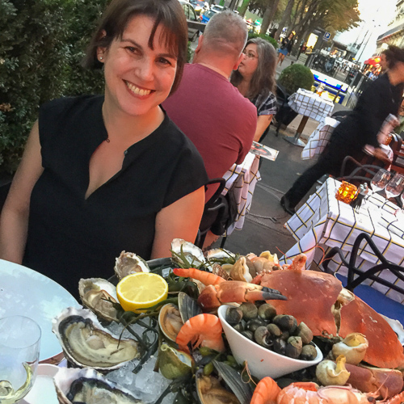
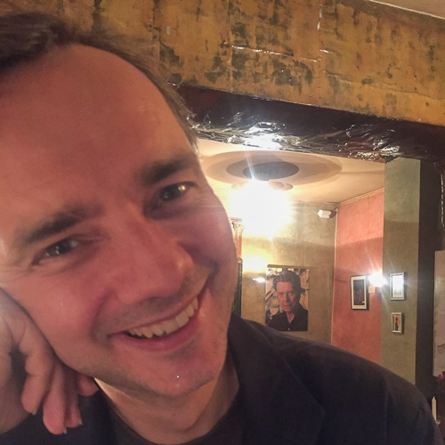

<h3>{{ title }}</h3>

Nora Maynard’s writing has appeared in _Salon_, _Food Republic_, _Leite’s Culinaria_, and _Chowhound_. She did a six-year run as a writer at _The Kitchn_ with her weekly columns “The Celluloid Pantry” (on food and drink in film) and “Straight Up” (on cocktails and spirits). [noramaynard.com](http://www.noramaynard.com)

<figure>

<figcaption>Nora Maynard - co-founder</figcaption>
</figure>

Chester Jankowski is a composer, musician, and technologist based in New York. He writes about music, the arts, and film, and is cultured nyc's resident baker and hot sauce fermenter. [chesterjankowski.com](https://www.chesterjankowski.com)

<figure>

<figcaption>Chester Jankowski - co-founder</figcaption>
</figure>

