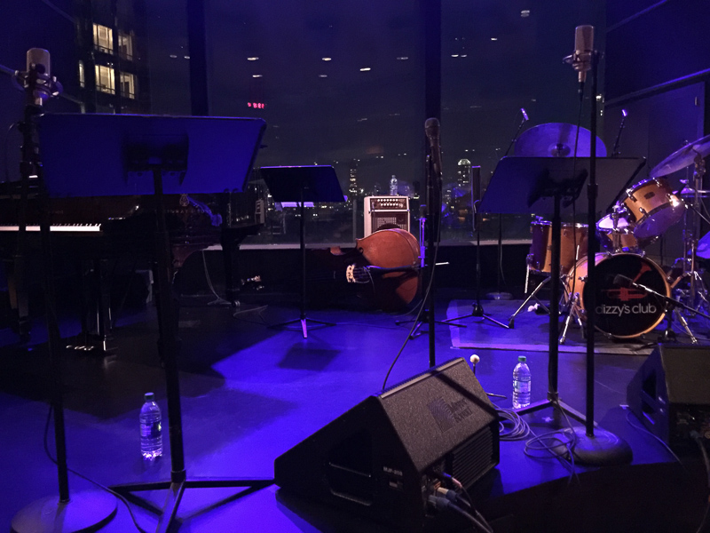

We are now in an era of jazz centenaries. Thelonious Monk, Dizzy Gillespie, and Ella Fitzgerald had theirs in 2017. Charlie Parker will have his next year. Barry Harris is just shy of ten years away from his. On October 11 2019, the honor goes to Art Blakey. Several events in New York this week will serve to commemorate. I caught One For All at [Dizzy’s](https://www.jazz.org/dizzys/) on Tuesday night. This supergroup sextet features [Eric Alexander](https://www.ericalexanderjazz.com/), [Jim Rotundi](https://www.jimrotondi.com/), [Steve “Stevie D!” Davis](http://stevedavismusic.com/), [David Hazeltine](https://www.davidhazeltine.com/), and [Joe Farnsworth](https://www.joefarnsworthdrums.com/). Eric had just flown in from Vancouver early that morning, and Jim had just flown in from Vienna.

I know Eric, Jim, and Steve from the Jamey Aebersold summer jazz workshops. I’ve played in combos supervised by Eric and Steve, and to put my cards on the table, they are both heroes of mine. I’ve been a fan of Eric’s ever since I first heard him play at [Smoke](https://www.smokejazz.com/) in 2005 with the Mike LeDonne quartet (and which I wrote about at the time).

Steve had the honor of getting picked by Blakey to join the Jazz Messengers right out of college. Steve played on the last two Messengers albums, his tune, One For All, became the title track of the group’s final record. There’s a story that Steve likes to tell about his early days with Blakey. Art took Steve aside, put his arm around him and said, “Listen, when you solo, you make statement, you build to a climax, then you get the fuck out!” “You got that?” Steve: “Yes.” Art: “Then fucking do it!” Truer words were never spoken!

<figure>

<figcaption>The stage at Dizzy's</figcaption>
</figure>

One For All first got together for a gig at Smalls in 1997. Since then, they have recorded sixteen albums together. I have to admit not knowing those albums previously, but I am looking forward to digging into them.

Through the course of two sets, the group ripped through a bunch of Blakey favorites, including Benny Golson’s _Along Came Betty_, and _Blues March_. During _Manteca_, it was all I could do to stop from shouting out the tune’s name, just like Dizzy and Chano Pozo did. Joe Farnsworth acted as MC for most of the night, and this night being about a great drummer, took several extended and thrilling solos.
