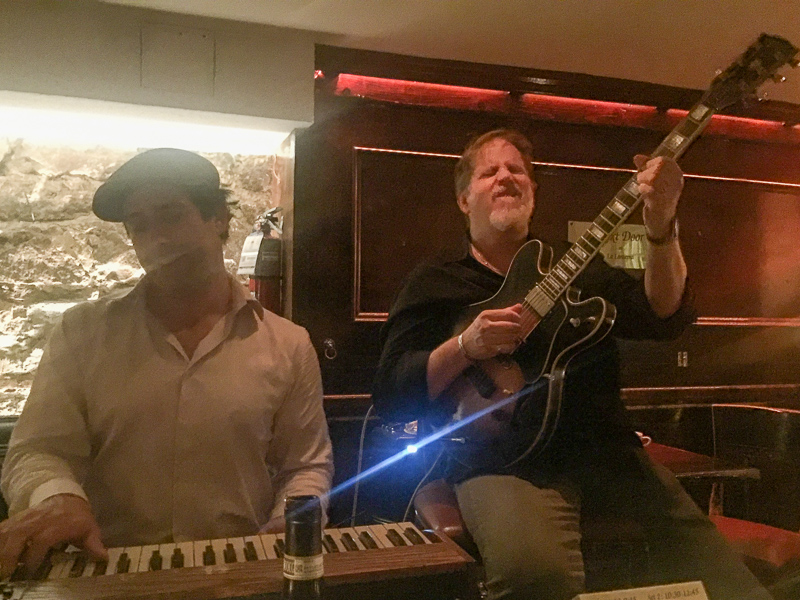

[Smalls](https://www.smallslive.com/) lives up to its name, and [Mezzrow](https://www.mezzrow.com/) is even smaller. [The Bar Next Door](https://lalanternacaffe.com/barnextdoor.html) is even more intimate than either. When you’re sitting at the tables directly in front of the musicians, you’re almost close enough to boop them on the nose while they play. We settled into one of those tables to catch [Dave Stryker](https://www.davestryker.com) and his trio Thursday night. The Bar Next Door, is “next door” to, or more accurately, in the basement of [La Lanterna](https://www.lalanternacaffe.com/), a nice Italian caffe and wine bar on Macdougal in the heart of the Village. The pizzas are good, the wine list is big, and there’s not a bad seat in the house, so it’s usually a good place to listen.

I first met Dave at the [Jamey Aebersold summer jazz workshop](http://workshops.jazzbooks.com/) in 2014, and since then I’ve been doing workshops, masterclasses, and online lessons with him, in addition to working through his books. He maintains an active teaching schedule, teaching at Indiana University and Montclair State. That’s on top of a very busy touring and recording schedule. I’ve learned a lot from him over the last five years, but more than that, I’m just a huge fan of his playing.

Originally from Omaha, Dave moved to New York in 1980 and had his first big break touring with Brother Jack McDuff in 1984-85. McDuff’s groups had included Grant Green, Kenny Burrell, George Benson, and Pat Martino. As Dave likes to tell the story, when he joined up, McDuff was luckily to have finally landed a “good guitarist!” From there, Dave spent a decade working with Stanley Turrentine. He’s firmly rooted in the hard bop tradition, and all the organ quartet and soul jazz pedigree infuse even his more abstract work with a down home groove.

The group launch into their first set. [Jared Gold](https://www.jaredgoldb3.com) is on organ, and [McClenty Hunter](http://mcclentyhunter.com/) is on drums. I’ve seen this combo a few times and they gel together from the first downbeat. Gold has been playing with Dave since 2004 and the trio has been the foundation of Stryker’s records since 2013’s Blue To The Bone IV and 2014’s Eight Track. That last record launched a terrific series, with Eight Track II coming out in 2016 and this year’s Eight Track III and Eight Track Christmas. The concept is to treat the pop songs of the 1970s (Superfly, Wichita Lineman, We’ve Only Just Begun) as new additions to the great American songbook and work them into jazz numbers. The more I hear this approach, the more I think it’s a good idea, and I think it’s especially welcoming for younger people who don’t know dozens of the old tunes.

<figure>

<figcaption>Dave Stryker and Jared Gold</figcaption>
</figure>

The band starts playing. A typical Stryker set will include originals, standards, bebop and blues. They play Autumn in New York. A woman and her parents walk in, sit down, and begin talking loudly in Italian. Dave calls the tune, “Too High,” insisting that it doesn’t describe the band. He’s trying to draw the Italians in, but the woman says it’s no use since her parents don’t speak a word of English. At the end of the tune, I helpfully call out to translate, “Troppo Alto”--maybe they thought I was shushing them, because they did quiet down for a few minutes after that.

The band is really cooking for the second set. I saw McClenty looking a bit tired in the break, but he really caught fire now. The set features a couple of blistering bebop tunes, including a super high energy take on Donna Lee. In honor of Thelonious Monk’s 102nd birthday, Dave does a lovely solo rendition of Ask Me Now. The set wraps up and we all go off into the New York Autumn night.
