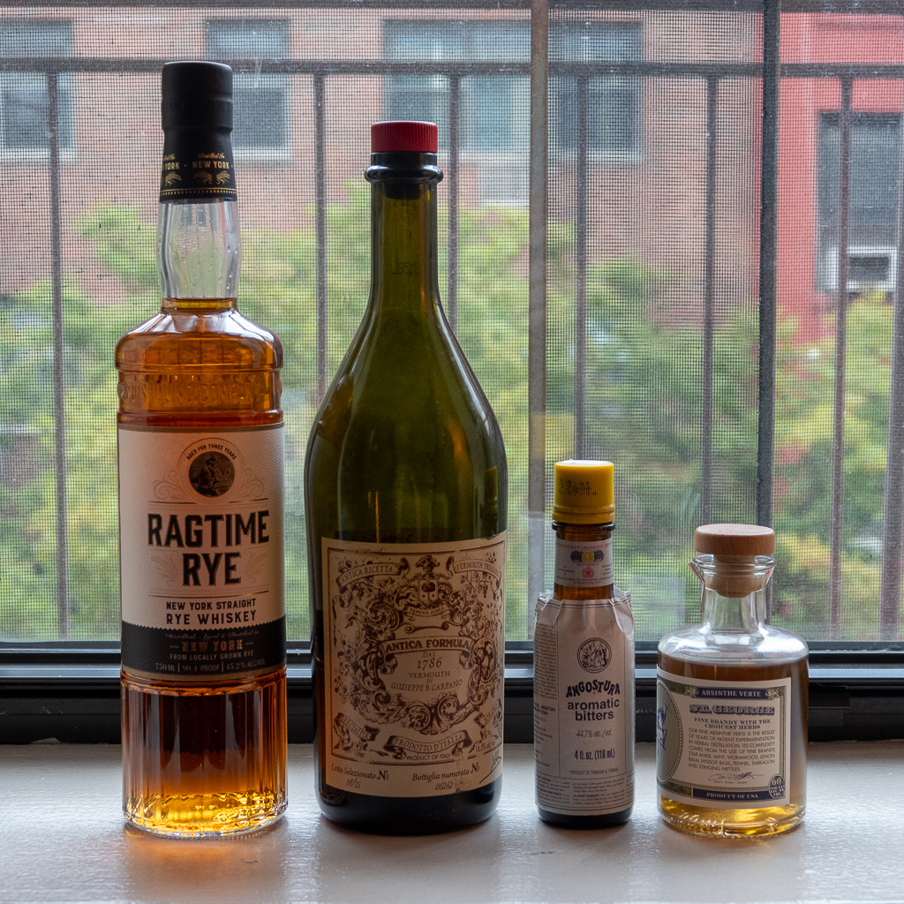
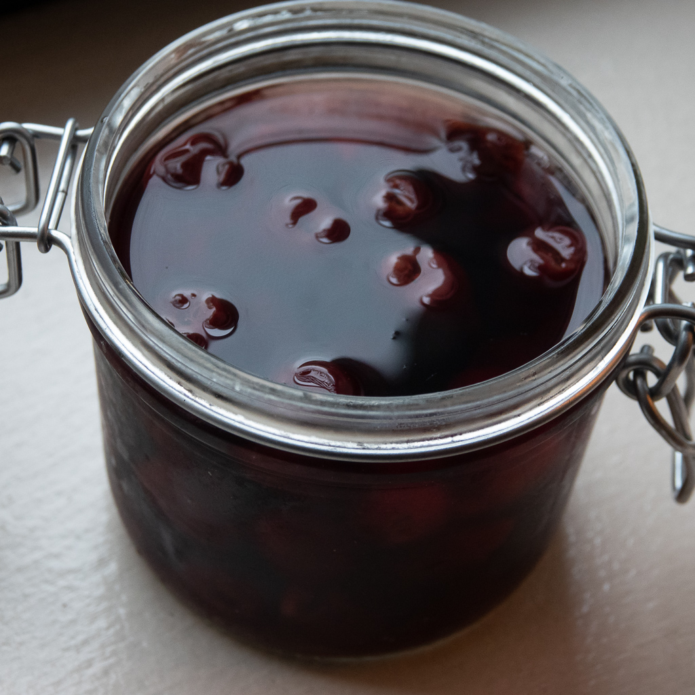
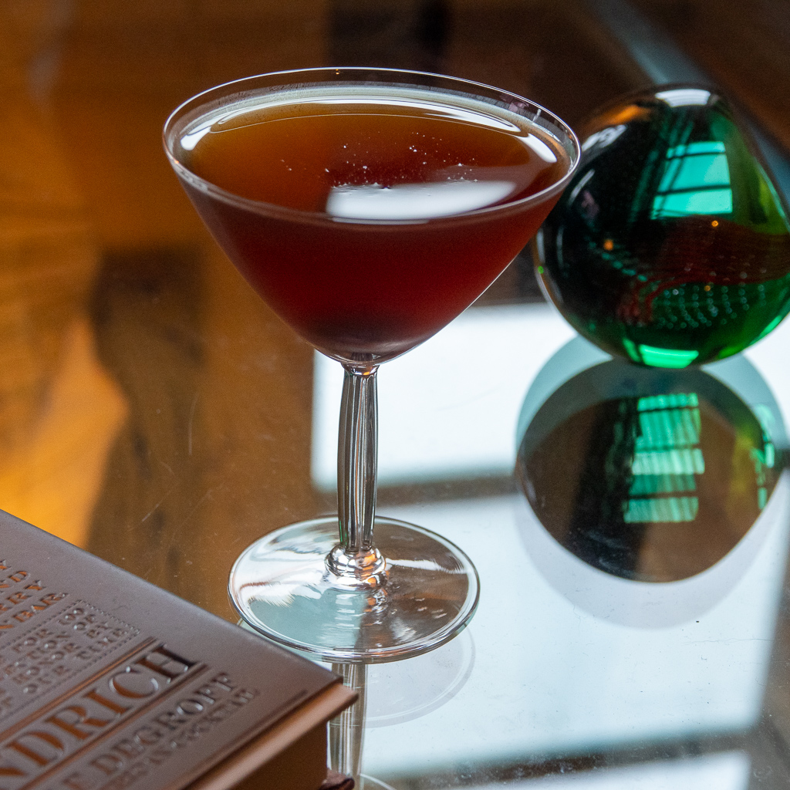

Welcome to the inaugural post in cultured nyc’s weekly cocktail column, Friday at five. It’s autumn in New York--our favorite time of the year. Even though we haven’t had much sweater weather yet, it’s time to start thinking about warming up with some whiskey. Not only that, but today is [Rye Day](https://www.grownyc.org/blog/rye-day-1011-union-square-greenmarket) at the [Union Square Greenmarket](https://www.grownyc.org/greenmarket/manhattan-union-square-m). Frye-day, if you will, kicking off a week-long celebration of New York state rye. We had the chance to sample rye whiskeys from [Breukelen Distilling](https://brkdistilling.com/), [Nahmias et Fils](https://www.nahmiasetfils.com/), and New York Distilling Company. We were taken with all of these, and will be featuring these whiskies in coming weeks.

For today, we will showcase [New York Distilling Company’s](https://www.nydistilling.com) Ragtime Rye American Straight Whiskey. This is a classic rye; 100% New York rye, aged for three years and bottled at 90.4 proof. On its own, it’s spicy, clean, well integrated. I had a feeling it would do well in a cocktail too.

The cultured nyc reference library has a pretty deep cocktail section, so where to turn for our first post? How about Dave Wondrich’s Imbibe? We’re starting off old school here, and this book is all about the old school. The Manhattan Formula #3 (New Standard) comes courtesy of William “The Only William” Schmidt in The Flowing Bowl, 1892.

- Half a tumblerful of cracked ice
- 2 dashes (1/2 Tsp) of gum
- 2 dashes of absinthe
- 2/3 drink (2 oz) of whiskey
- 1/3 drink (1 oz) of vino vermouth
- (a little maraschino may be added)

- 
- 
- 

This is close to the Manhattan we always make here at cultured nyc, maybe a touch sweeter on the vermouth. Per Dave’s recommendation, we left out the simple syrup. We also left out the maraschino, but did add one of Nora’s very fine house-made [maraschino cherries](https://www.thekitchn.com/diy-recipe-boozy-cherries-3-wa-121134). I was, however, very curious about the absinthe. A tiny bit of absinthe can completely transform a drink. I was worried that this would turn into some sort of weird Sazerac. But it didn’t! Not quite anyway; it added a green ‘undertaste’. I don’t think I’ll turn this into my new standard, but I certainly enjoyed it.
