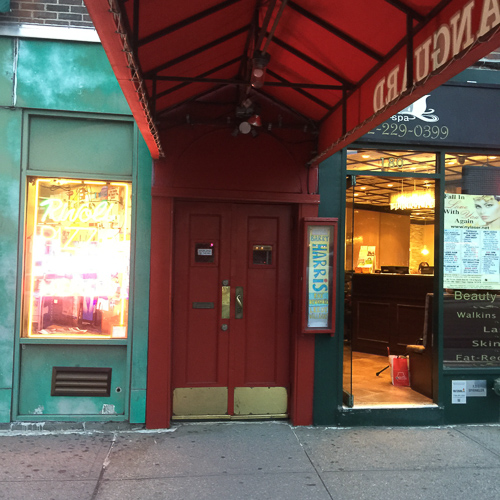
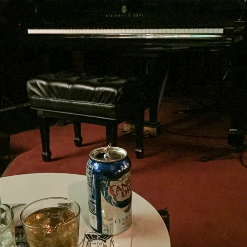

How early do you have to arrive to be the first in line at the [Village Vanguard](https://villagevanguard.com/)? I found out last weekend, two nights in a row. The first set at the Vanguard starts at 8:30, and the doors open at 7:30. On Saturday night, we gambled that 6:45 would be early enough. And it was, but just barely, because the line began forming behind us within a few minutes. We always run into nice people on line at the Vanguard. We met Dan, who had flown in from Detroit just to catch [Barry Harris](http://barryharris.com/). Dan is a Barry Harris superfan, but not a musician himself.

Dan flew in from Detroit just to see Barry Harris at the Vanguard. The first time I saw Barry, the chap sitting next to me had flown in from Dallas, and was catching every set that week. On a later date, the person in front of us on line had flown in Toronto. We had a nice chat and it turned out he was Elvis Costello’s guitar technician. Ok, so why are people flying in all over to hear a pianist in his late 80s?

In order to understand that, you need to know a couple of things, one is Barry’s place in jazz history, and the other is his role as an educator. History first. Barry was born in Detroit in 1929, and based there through the end of the 50s. While in Detroit, Barry served as a mentor and music teacher to all the young players who were around the scene at the time, including Paul Chambers—much like Monk had been doing in New York in earlier years. Barry moved to New York in 1960, and his recording career began in earnest. Since then, he’s recorded twenty-five records as a leader, and appeared with a long list of greats, including Cannonball Adderley, Donald Byrd, Benny Golson, Dexter Gordon, Coleman Hawkins, Sam Jones, Hank Mobley, Lee Morgan, and Sonny Stitt. Odds are, you have at least heard him play on Lee Morgan’s hit, _The Sidewinder_.

Stylistically, Barry has strong links with two other pianists, Bud Powell and Thelonious Monk. Of the two, Barry’s playing is closest to Powell’s in harmonic approach and melodic approach. Powell’s melodic language is classic bebop; if you could imagine Charlie Parker playing the piano, you would wind up with Bud Powell. Monk’s own style was of course unique, but he and Powell were friends and certainly admired and influenced each other. But Barry had a much closer personal connection with Monk—they lived together in Baroness Pannonica de Koenigswarter’s house in Weehawken in the 1970s until Monk’s death in 1982. (Nica was a patron of jazz, and bebop in particular, perhaps most famous for her relationship with Charlie Parker. When Bird died on March 12, 1955, it was in Nica’s apartment at the [Stanhope](https://en.wikipedia.org/wiki/995_Fifth_Avenue), across the street from the Metropolitan Museum of Art.) Barry still lives in that house in Weehawken.

So Barry had already been a teacher and a mentor in Detroit in the 1950s. In the 1970s, he started teaching workshops in New York. From 1982-87, he taught at the Jazz Cultural Workshop, which he co-founded. Since then, he has maintained his own weekly workshops in New York. I first started attending them off and on about five years ago. They take place every Tuesday night when Barry is in town, from six until midnight, divided into sessions for pianists, singers, and then at ten, improvisers on all instruments. The only reason I don’t go every week is that I already have enough of Barry’s materials to work on for the next few decades. When Barry is on tour internationally, he conducts workshops there too. Through that process, he has developed a couple of generations’ worth of acolytes. One of the most prominent of the younger generation is the brilliant Italian guitarist [Pasquale Grasso](https://www.pasqualegrasso.com/), who has standing set at [Mezzrow](https://www.mezzrow.com/) every Monday night. If Bud Powell is like Charlie Parker playing the piano, Pasquale is like Bud Powell playing the guitar.

<figure>

<figcaption>First in line</figcaption>
</figure>

<figure>

<figcaption>Barry Harris Trio</figcaption>
</figure>

<figure>

<figcaption>Night two seats</figcaption>
</figure>

We settled in for the first set on Saturday night. Having arrived first, I was able to grab the seat directly to Barry’s left, maybe two feet away from him. Barry came on with his trio of many years, with [Ray Drummond](https://en.wikipedia.org/wiki/Ray_Drummond) on bass, and [Leroy Willams](https://en.wikipedia.org/wiki/Leroy_Williams) on drums. Barry began his banter. It had been a tragic couple of weeks for master jazz pianists. [Harold Mabern](https://www.nytimes.com/2019/09/23/arts/music/Harold-Maborn-dead.html) had died on September 17, [Richard Wyands](https://jazztimes.com/features/tributes-and-obituaries/richard-wyands-1928-2019/) died on September 25, and [Larry Willis](https://jazztimes.com/features/tributes-and-obituaries/larry-willis-1942-2019/) died on September 29. Barry sang a tune dedicated to all three. For the rest of the set, Barry narrated an improvised story that he used to introduce each tune. “You are walking down the street, and you see someone who looks really fine, and you think to yourself, ‘_I Want To Be Happy_.’” Hit it. Later on, Barry played _Blue Monk_, and I still have goosebumps thinking about it. The set wrapped up with one of Barry’s audience participation numbers, which he referred to as “jazz karaoke.” “Ok, we need a number from one to eight.” Someone calls out, “eight!” and we all feel bad for that guy. “No, man,” Barry laughs, “something better than that!” Barry is asking for musical intervals, out of which he will improvise a new tune. I think that night the pattern was “two-four-five-three.” A few members of Barry’s choir were in the audience, and they sang along. I sang along too. I always look forward to Barry’s tune Nascimento, which will often end a set and is another tune that the audience sings and claps to, but he ran out of time.

The set ended too quickly, and we only had tickets for the first one. I arranged to meet Dan for the first set Sunday night. I only had a ticket for the second set, Dan was gracious enough to gift me the extra ticket he had. How early to arrive Sunday night? I really wanted to make sure I got there early enough, so this time I arrived at 6:15. Again, I was first in line. But this time, I was joined even more quickly, and then more and more people arrived. Several people from the workshop, including some of the choir members. Dan arrived. It started raining lightly, and the person working the door told us we could stand under the awning, but only up to “this line,” gesturing to a crack in the sidewalk. A woman from Germany came over and asked if she could share the awning. She wasn’t trying to sneak in, honest, just keep dry. She was dressed for an evening out, and wearing Chanel No. 5. Her husband stayed back in line in the drizzle, it was OK, he had a hat on.

7:30, time to sit down. Dan and I grabbed table one, right at the stage. Barry seemed a little happier and a little more relaxed on this night. Through two sets, he brought out several guests, a couple of his piano students, a trumpet player, a singer. I had an extra ticket for the second set, and I was able to pay it forward to a gent sitting in the back who needed one. He was, our server told us, another Barry superfan. [Ethan Iverson](https://ethaniverson.com/) came in and sat down at the table to our left. Towards the end of the second set, the gentleman who had been second in line hopped up on stage and did a beautiful modern jazz dance to one of the tunes. As always, the second set of the last night featured the choir for most of the numbers. It’s such a sweet, glorious sound, evocative of the choral jazz of the 1960s.

The set was over, the week-long stint was over. Barry and the band milled about the stage and Barry kept on joking around with the audience. He finally ended his patter with, “We’ll be black...” And then, “we’ll be white… black.”
