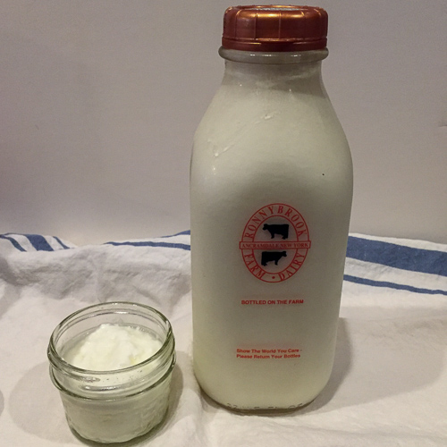
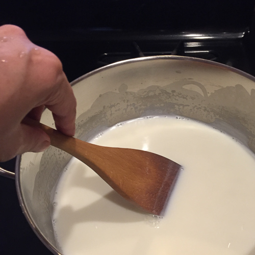
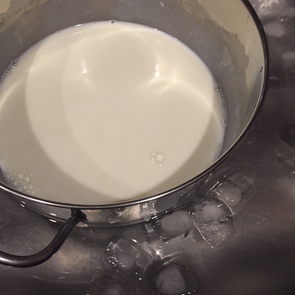
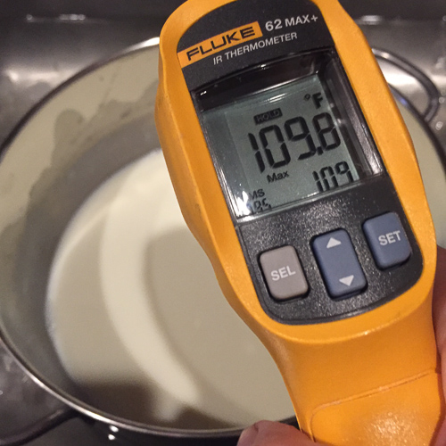
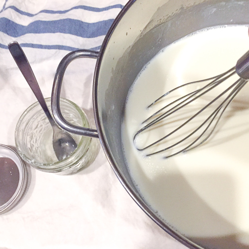
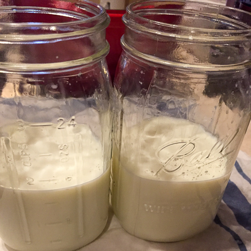
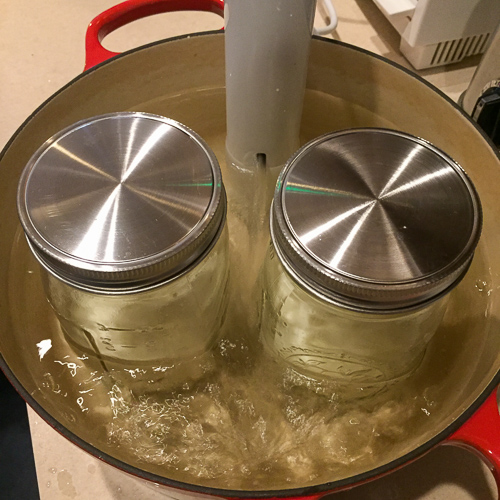

I've always been wary of unitaskers in the kitchen, those one-trick pony gadgets that get used for a few short weeks or months before falling into back-of-cupboard oblivion. But after watching a [demo video](https://www.americastestkitchen.com/episode/615-sous-vide-for-everybody) on America's Test Kitchen, it was clear a sous vide machine could offer big multitasker potential.

If you're not already familiar, sous vide machines (aka immersion circulators) are devices that warm up water to a set temperature, and hold it steadily for a slow, precisely-controlled cook. The latest generation of machines are small--about the size of a stick blender. You can use them with any large container you have on hand to hold the water bath (dutch ovens are a go-to choice). Depending on the recipe, the food goes into a waterproof (plastic or silicone) bag or a jar.

Because they maintain such a reliably precise temperature, they're easy to use. No stirring or flipping necessary. And no scorching or overcooking. Just preheat the water, set the timer, and the machine does the rest.

Right out of the box, Chester dove in and was soon making perfectly cooked shrimp for shrimp cocktails, poached eggs simmered right in their shells, and dried beans cooked so gently their skins stayed intact. The only dish that got mixed reviews was salmon: Chester loved it for its lightly cooked tenderness, but I found myself craving something crisper-edged and more well-done.

I'd been meaning to try my hand at homemade yogurt for a long time, but didn't have a dedicated yogurt maker (unitasker), and hadn't gotten around to investigating work-arounds like thermoses, heating pads, pre-heated ovens and the like. But the sous vide machine made my first attempt easy.

The only ingredients you need for yogurt are milk and a few tablespoons of plain yogurt with live cultures.

For the milk, I chose whole, non-homogenized, but lowfat would work well too. For the yogurt, I looked for something without additives (many brands add thickening agents), containing just whole milk and bacterial cultures.

The basic steps are simple: preheat the sous vide, warm the milk, cool the milk, whisk in the yogurt, place the mixture in jars in the sous vide bath, set the timer and wait.

- 
- 

- 
- 

I checked on my yogurt-in-progress a couple of times as it sat in its warm bath, and was amazed at how quickly the bacterial cultures got down to business. The milky mixture began to show signs of setting within the first hour. By the time I checked again, 8 hours in, it was definitely yogurt. I tasted a little and it had a familiar creamy texture, but was still a little bland. I let it go another few hours until it took on that classic tangy flavor.

- 
- 
- 

## Sous Vide Yogurt

- 1 quart milk
- 3 tablespoons plain, full fat yogurt

Fill a large dutch oven or other large, flat-bottomed container with water until it reaches the level of the sous vide jet. Preheat to 110F.

Gently heat the milk in a saucepan, stirring constantly until it reaches 180F. Turn off heat and immerse the saucepan in an ice bath until the temperature of the milk drops to 110F. Whisk in yogurt. Pour mixture into jars (I used two 32-ounce wide-mouth mason jars, filling each half way, level with the water line, then combined them into a single jar when the yogurt was ready). Screw lids on jars, securely, but not too tight. Set timer for 12 hours. Remove from water bath and stir. Chill in refrigerator.
