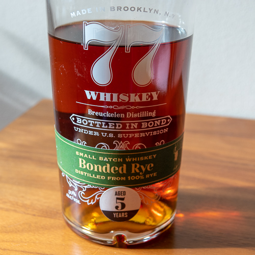
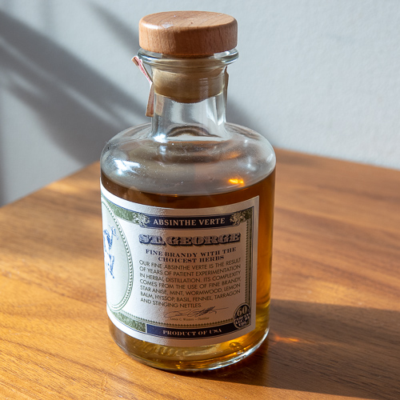
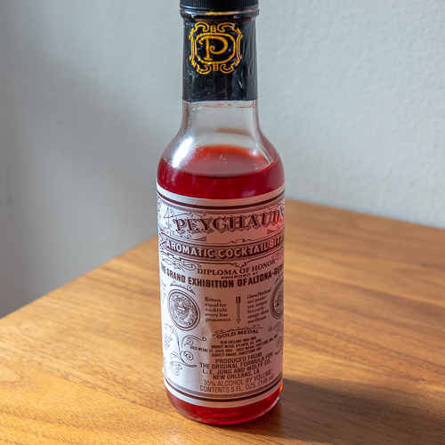
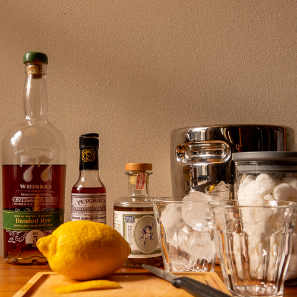
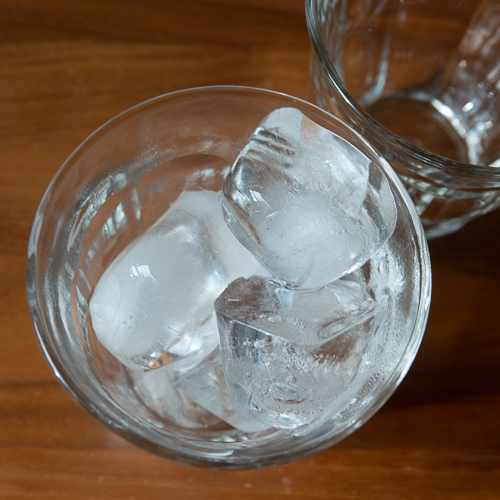
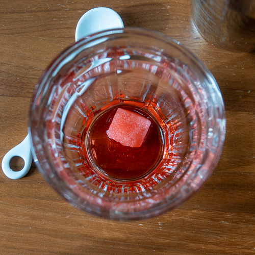
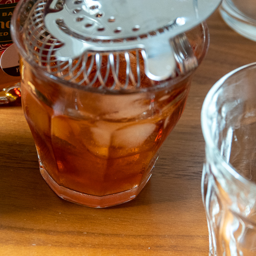
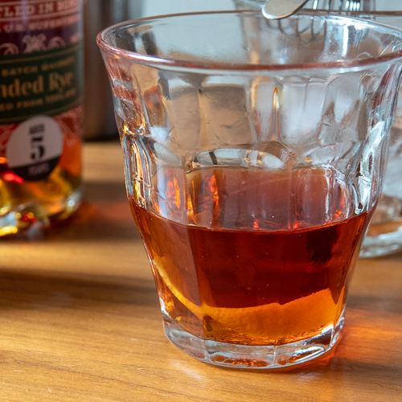

Few drinks are as evocative of a place and time as the Sazerac. The place is New Orleans, and the time is mid-century. Mid-19th\-century that is, near the beginning of the cocktail story. Apothecarist Emile Amedée Peychaud was selling his namesake bitters, mixed with brandy. John Schiller was the New Orleans agent for Sazerac de Forge et Fils Cognac. In 1859, he opened his bar and dubbed it the Sazerac Coffee House. Schiller gave the Sazerac cocktail, made with Peychaud’s bitters and Sazerac cognac, its name. Later on, in 1870, the preferred base changed from brandy to rye whiskey. This much is established. Claims that the Sazerac was the first cocktail, and claims around the origins of the term ‘cocktail’ itself are probably apocryphal (or is that apotheracril?) These details aside, our credo is that New Orleans gave America two of its greatest inventions: cocktails and jazz.

The best Sazerac I ever had was years ago during [Tales of the Cocktail](https://talesofthecocktail.org/) in New Orleans. Nora was at an event for the afternoon, so I was free to while away a few hours in the [Napoleon House](https://www.napoleonhouse.com/). It was a beautiful day and the way the sunlight was playing inside the bar is impossible to describe or forget. While we all enjoyed Sazeracs, I chatted for over two hours with a couple from Baton Rouge. I have no idea what we talked about, and I suspect the only thing we had in common is that we all appreciated the beauty of that moment.

#### Ingredients

- Generous 2 oz pour of whiskey
- 1 lump of sugar
- Several dashes of Peychaud’s bitters
- Several dashes of absinthe
- Lemon twist

- 
- 
- 

#### Notes on Ingredients

For the whiskey, we used [Breukelen Distilling](https://brkdistilling.com/)’s 77 Whiskey Bottled in Bond. We picked this up during [New York Rye Week](http://ryeweek.com/) at the [Union Square Greenmarket](https://www.grownyc.org/greenmarket/manhattan-union-square-m) and have been enjoying it neat, in cocktails and on the rocks. For the Absinthe, we used [St. George Spirits](http://www.stgeorgespirits.com/) Absinthe Verte. There is no substitute for the Peychaud’s bitters, although some reputable establishments, including the Napoleon House, use a mix of Peychaud’s and Angostura bitters.

- 
- 
- 
- 
- 

#### Method

Gather two tumblers. (We are using [Duralex Picardie tumblers](https://www.duralex.com/picardie.html?lang=2) that we just found at [Housing Works](https://shop.housingworks.org/) for a dollar a piece!) Fill one tumbler with ice and chill. In the second tumbler, add the lump of sugar. Add dashes of Peychaud’s bitters to cover the sugar. Muddle the sugar and bitters with the back of a spoon. Add the whiskey and stir. Add ice to fill the glass. Prepare the second tumbler: discard the ice. Rinse the glass with the absinthe, and discard the absinthe. Using a Hawthorne strainer, strain the drink from the build tumbler into the chilled tumbler. Garnish with a lemon twist and serve.

Suggested film pairing: this one is a no-brainer, as featured in Nora's _Classic Cocktails, Classic Film_ series, it’s Live and Let Die from 1973.
