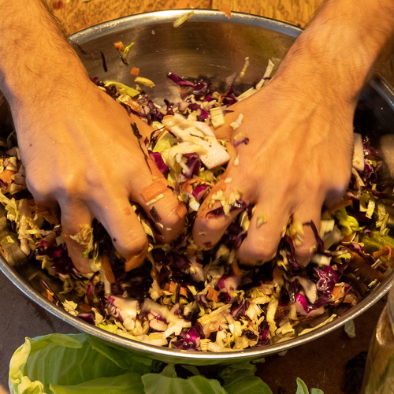

Friday was a gorgeous day in New York, perfect for our weekly visit to the [Union Square Greenmarket](https://www.grownyc.org/greenmarket/manhattan-union-square-m). Who knows how many more days we will have like this? Traditionally, end of harvest is the last chance to ferment, can, and store food for the rough season ahead. Even though we already have plenty on hand, we stopped off at the Oak Grove Plantation stall to get another beautiful batch of chilis for this year’s fermented hot sauce production. We also picked up some green and red cabbage, and bolero carrots for our latest fermentation project, sauerkraut. Sauerkraut is not exactly a staple of ours, but Nora has been making excellent [homemade kimchi](https://www.culturednyc.com/whats-fermenting-easy-homemade-vegan-kimchi/) for a couple of years now, and we thought this would be a good time to branch out.

I grew up in a very Polish household. Every house we lived in had either a proper root cellar, or various nooks in the basement where my mother squirreled away mass quantities of canned foods and homemade treasures: dill pickles, jams, and always a giant vat of sauerkraut. You may think that the Polish national dish is pierogi or cabbage rolls, but in fact, that honor goes to bigos. Bigos is a hunter’s stew made sauerkraut, fresh cabbage, and various meats. Growing up, it was served at pretty much every formal dinner my parents had with their various friends and relatives. I never really cared for it as a kid, and haven’t really had the opportunity to try it since becoming a pescatarian over twenty-five years ago. We will try out some vegetarian bigos recipes in coming weeks. I am also really dying to try a vegetarian Reuben sandwich recipe.

- 
- 
- 

## Ingredients

- 1 head green cabbage
- 1 head red cabbage
- 4 carrots
- Sea salt

## Method

1. Clean cabbages and retain some of the outer leaves.
2. Scrub and trim 4 carrots, do not peel.
3. Shred each cabbage into a large mixing bowl.
4. With a peeler, shred the carrots into the mixing bowl.
5. Mix to evenly distribute the cabbages and carrots.
6. Weigh the shredded cabbage and carrots, add 2% salt by weight.
7. Let sit for 5-10 minutes.
8. With both fists, take handfuls of the mixture and squeeze, to release the moisture. Keep doing this until water flows from the cabbage like wringing a wet sponge.
9. Tightly pack mixture into Mason jars or sauerkraut crock.
10. Take some of the outer cabbage leaves and use as a ‘lid’ inside the jar or crock. Push down to make sure all is submerged by the brine.
11. NB: if using a lidded Mason jar, you must periodically loosen the jar or open the lids to allow gasses to escape. Fermentation will be at its most vigorous for the first few days.
12. Periodically taste. After a few days, it will be crispy and fresh tasting, for weeks and months after that, it will develop sourness and deeper flavors. Eat it when you like it!

- 
- 
- 

## Notes

The main vessel we are using to ferment this is a 1.5L vintage [Le Parfait Super Jar](https://www.leparfait.com/le-parfait-super-jars) that Nora found at the [Housing Works](https://www.housingworks.org/) Thrift Shop. We closed the lid when we packed it, and by Saturday evening, the gas buildup was substantial, opening the lid released a violent spritz of purply brine. After that, we have mostly been keeping the lid loose. When first shredding all the cabbage, it seemed like it would be an enormous volume, but that went down after the squeezing step, and went down further after packing into the jar.

Looking at recipes, a 2% salt by weight appears to be a common target. For folks like us, who are watching our sodium intake, that may be a bit too much. [Sandor Katz](https://www.wildfermentation.com/) recommends salting to taste.
