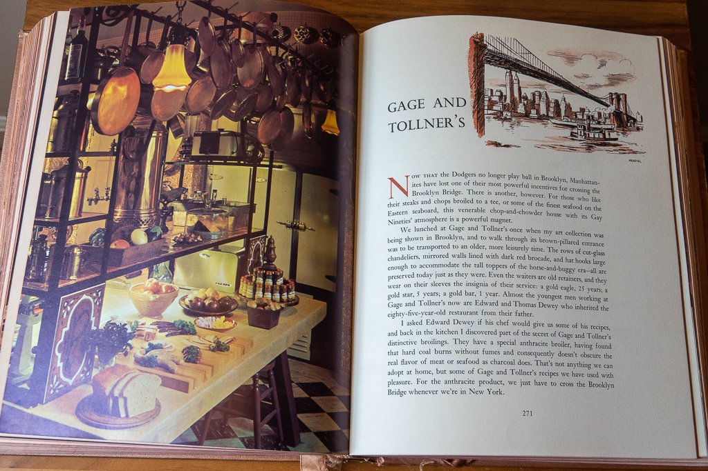
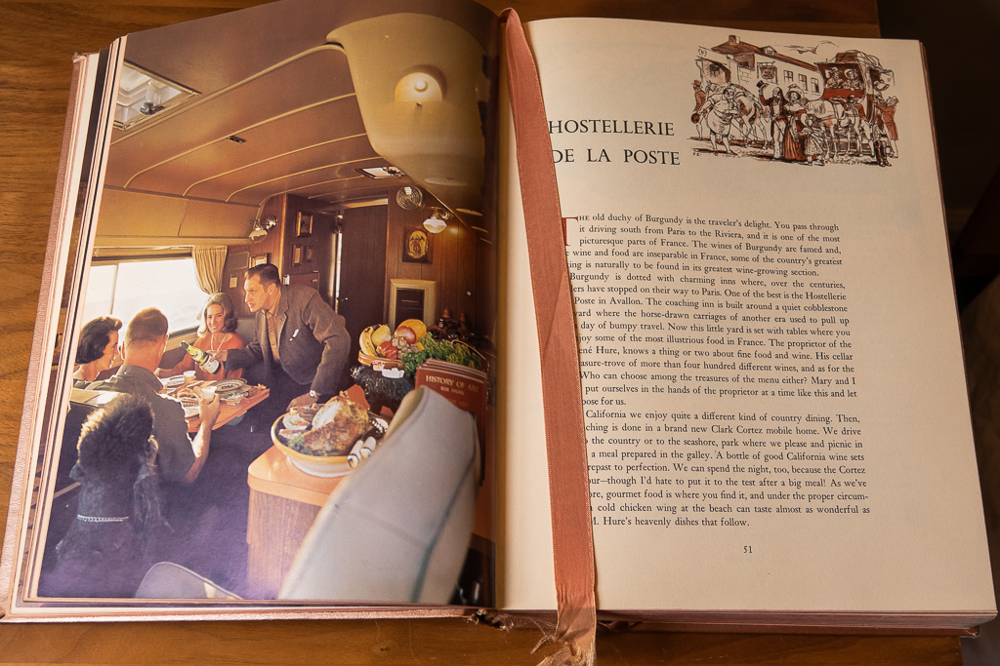

I've always loved Vincent Price's ghoulish persona as a horror actor. He combined rarefied charm with an uncanny creepiness. But he was also clearly having fun, and he wanted us all to be in on it.

He brought that same generous sense of fun to his work as a cookbook author. In 1965, he and his British-born, costume designer wife, Mary Price, published the first of what would be several celebrity cookbooks: _A Treasury of Great Recipes_.

The globe-trotting couple collected house recipes from chefs at their favorite restaurants across Europe, the United States, and Mexico. There are many NYC stalwarts from years gone by (The Four Seasons (RIP), Trader Vic's (RIP), Sardi's, Gage and Tollner's (RIP, but [returning soon?](https://gageandtollner.com/))). Everything is adapted for the 1960s American home cook. The ingredients are simple and the recipe headnotes are encouraging ("If you can lay brick you can frost a cake"... ok, maybe not the best example). The Prices vividly describe the history and ambiance of each restaurant in before getting to the recipes. Full menus are reprinted too (can you believe sea bass at The Four Seasons used to cost $4.65?)

<figure>

<figcaption>

The Prices visit Brooklyn's storied restaurant, Gage and Tollner's

</figcaption>

</figure>

I snagged a vintage copy online about 10 years ago for around $20--roughly the same as what it listed for back in 1965. It's a lush volume: gold-embossed, padded cover (think Ottolenghi's oh-so-huggable _Plenty_), with two sewn-in satin ribbon bookmarks. Very deluxe.

I was tickled to learn the book was [re-issued in 2015](https://www.amazon.com/Treasury-Great-Recipes-50th-Anniversary/dp/1606600729/ref=sr_1_1?crid=19W1N82EGQE6R&keywords=vincent+price+treasury+recipes&qid=1572477189&sprefix=vincent+price+trea%2Caps%2C248&sr=8-1) for its 50th anniversary. No more cushy cover, but now with a preface by the late Prices' daughter, Victoria, plus a foreword by Wolfgang Puck. A well-deserved return from the publishing grave.

<figure>

<figcaption>

The Prices entertain guests on the go in their elegant mobile home

</figcaption>

</figure>

By the way, are you getting a Halloween pumpkin this year? Chester and I got one, but haven't carved it yet. Once we do, we're going to put the seeds to good use. Here's a recipe for pepitas à la curry that Emilio Gonzalez, then owner of Sobrino de Botín in Madrid, shared with with the Prices during one of their visits. The original specifies commercially hulled pumpkin seeds (aka pepitas), but we're going to give whole seeds a try.

#### **Pepitas** à **la Curry (Curried Pumpkin Seeds**)

(adapted from _A Treasury of Great Recipes_ by Mary and Vincent Price)

- 1/4 cup curry powder
- 1-1/4 cup warm water
- 1 clove garlic, finely minced
- 1 tsp salt
- juice of 1 lime
- 2 cups pumpkin seeds (original recipe specifies commercially hulled pumpkin seeds, aka pepitas)
- a few tablespoons butter

Preheat oven to 225

In a saucepan mix the curry powder, 1/4 cup of the warm water, garlic, salt, and lime juice. When smoothly blended, add the remaining water and heat, stirring constantly until liquid simmers.

Add the pumpkin seeds and simmer, but do not boil, for 5 minutes. Drain (you can save the curry mixture to use again for another batch, adding more water when you do).

Spread pumpkin seeds on a cookie sheet. Dot with butter and sprinkle with salt. Toast in a very slow oven until crisp.

Happy Halloween!

<iframe width="560" height="315" src="https://www.youtube.com/embed/F9Kkg1A6hcA" allowfullscreen></iframe>
