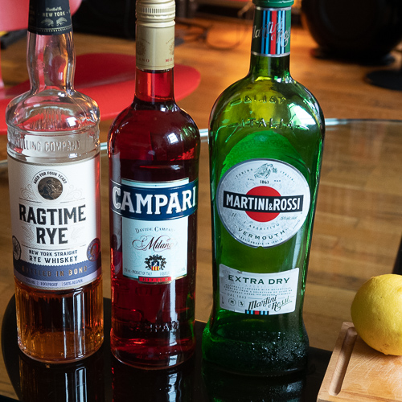
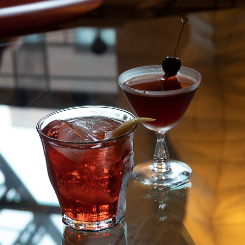
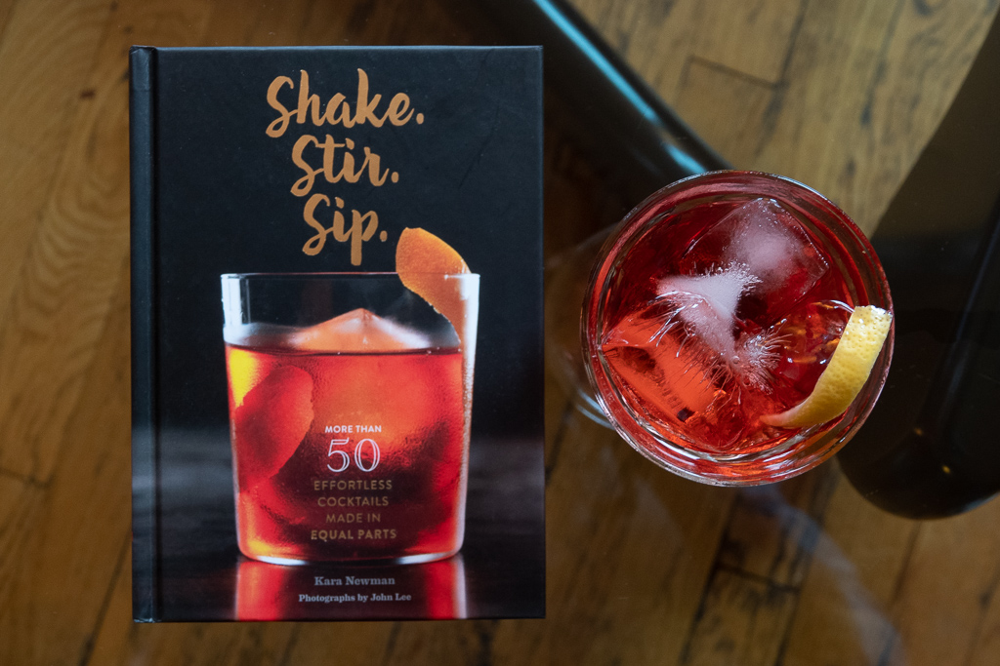

A guy walks into a bar:  
Bartender: "What's yours?"  
Guy: "Old Pal."  
Bartender: "Listen buddy, I don't know you from Adam. So I'll ask you again, what'll it be?"  
Guy: "I'd like an Old Pal, please."  
Bartender: "What in hell is that?"  
\--end scene

Some version of this scene has been playing over and again for me, minus the Capra-esque patter, for many months now. I've been conducting a bit of an experiment, and have found that hardly anyone, bartenders included, knows how to make an Old Pal. I think the bartender at [Elixir](https://www.elixirsf.com/), a truly excellent bar in San Francisco, may have been the only one who remembered it. And that's a shame, because it's a great drink.

I'm a big fan of Negronis--they're my go-to when I'm looking for a gin cocktail that's as bracing as a slap across the face. A few years ago, I fell in love with Boulevardiers, which swap out the gin for bourbon. I was in Louisville for two weeks this summer, and had one of those pretty much everywhere I went. But Nora and I both have a preference for rye whiskey over bourbon, at least in cocktails, and that's where the Old Pal comes in. If you swap out the bourbon in a Boulevardier for rye, and also swap out the sweet vermouth for dry vermouth, now you have an Old Pal. This is exactly how I explain the drink to a bartender who doesn't know what an Old Pal is. If they also don't know how to make a Boulevardier, I'll order a whiskey on the rocks.

The drink was created by Harry MacElhone, of Harry's New York Bar in Paris, in honor of his friend and frequent customer, William "Sparrow" Robertson, a sports writer for the New York Herald. Robertson would call everyone his "old pal," and the drink was named. The associations with Harry's and Paris in the '20s complete the allure of the drink for me.

## Ingredients

- 1 oz Rye Whiskey
- 1 oz Campari
- 1 oz Dry Vermouth
- Lemon twist

- <figure>
    
    
    
    <figcaption>
    
    Old Pal ingredients.
    
    </figcaption>
    
    </figure>
    
- <figure>
    
    
    
    <figcaption>
    
    Old Pal versus Boulevardier.
    
    </figcaption>
    
    </figure>
    

## Method

Build in a tumbler filled with ice. Serve with a lemon twist for garnish.

Given the similarities between the Old Pal and the Boulevardier, I thought it would be instructive to mix up one of each and do a side-by-side comparison. I was expecting the Old Pal to be crisper and the Boulevardier to be sweeter, and I was blown away by how much that turned out to be the case. The Boulevardier was tasting almost like sweet cough syrup in comparison to the sleeker, racier Old Pal. I think I will keep ordering them!

And speaking of old pals, our friend Kara Newman has a great book, "[Shake. Stir. Sip.](https://amzn.to/2NAP9LX)" which features the Old Pal, and about 50 other equal parts cocktails. It's worth checking out, as are all her books!

<figure>

<figcaption>

Kara Newman's great book, _Shake. Stir. Sip._ features equal parts cocktails.

</figcaption>

</figure>
