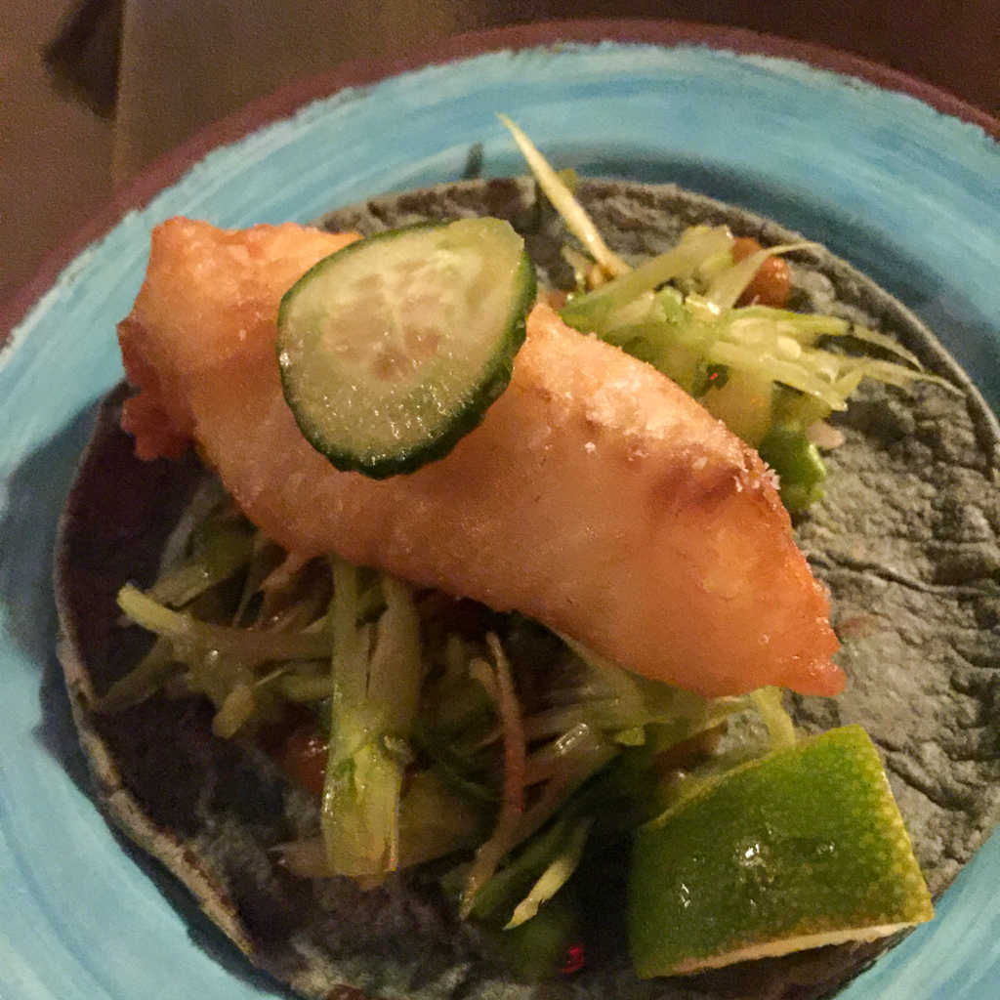
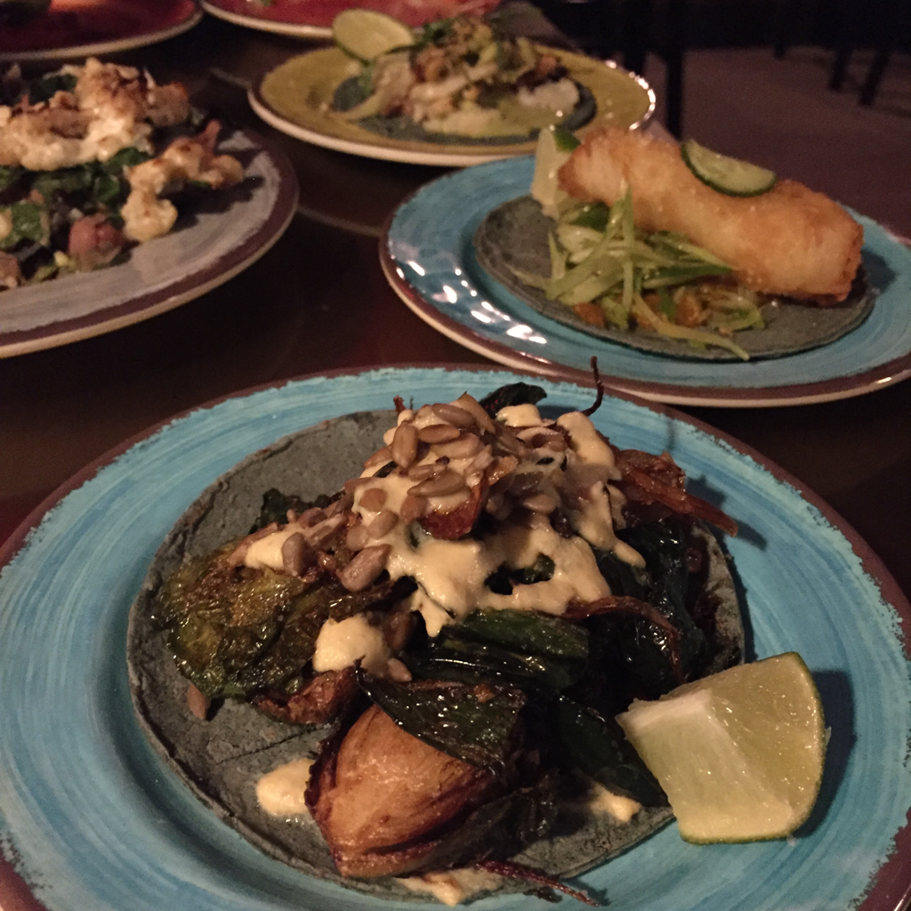
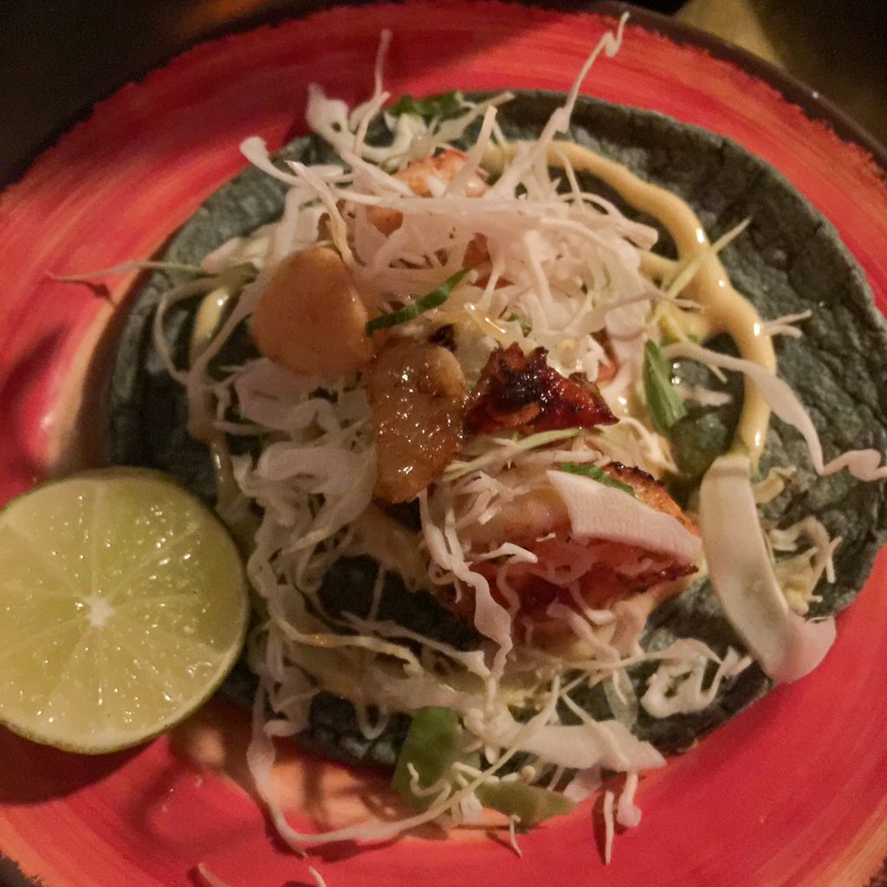
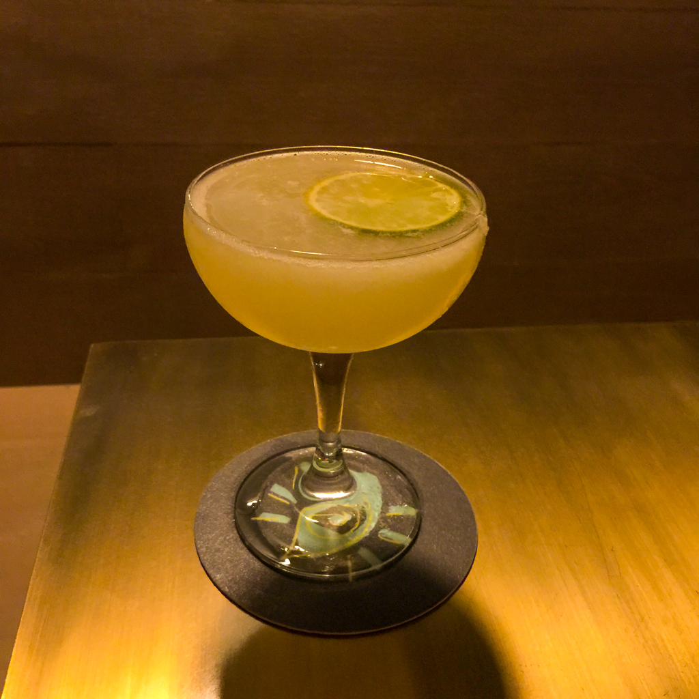
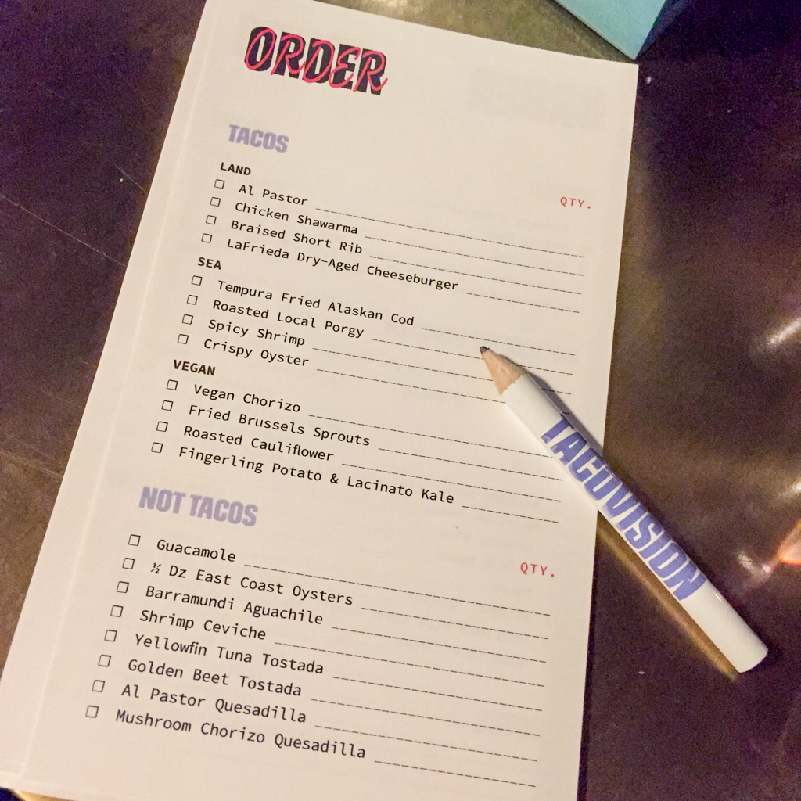

When we heard that the folks at [Crave Fishbar](https://cravefishbar.com/) were opening a taco joint in our hood, we were thrilled. Crave is our go-to seafood restaurant in Midtown East, and it’s got a lot going for it: great oysters, a solid wine list, healthy and delicious fish and seafood options, and a really lively dining-at-the-bar scene. So we had high hopes for [Tacovision](https://tacovisionnyc.com/), the team’s new taco bar on East 53rd Street. With the Crave pedigree, we were expecting great fish and seafood options, as well as solid vegetarian and vegan choices. In short, we were not disappointed.

We visited TV—as the cool kids already call it, no doubt—on taco Tuesday. In addition to $6 margaritas, they were featuring a $3 brussels sprouts taco. There are plenty of options for us non-carnivores, with four vegan taco options, and four pescatarian. We went with three of each, and also opted for vegetarian nachos. The nachos were serious business, piled high with kale and cauliflower, beans, and cheese—decidedly not nachos “Flanders’ style!” All of the tacos were great, with the fried cod taking first place in our ranking. The house-made blue corn tortillas were very good. The $6 margs were good too. We ordered them up, and they came cold, an in an appropriately-sized cocktail glass.

<figure><figcaption>Cod fish taco</figcaption></figure>
<figure><figcaption>Kale and potato taco</figcaption></figure>

<figure><figcaption>Shrimp taco</figcaption></figure>

With the departures of some good, and some not so good, Mexican and taco joints, Midtown East is currently a little underserved for tacos. Sure, there are solid upscale versions at Pampano and [Rosa Mexicano](https://www.rosamexicano.com/) (as well as Maya and [Cascabel](https://nyctacos.com/) a little further uptown). So Tacovision has a sporting chance of finding a solid niche. The block of 53rd between 2nd and 3rd is already home to some of our neighborhood favorites: Doug Quinn’s saloon [Hudson Malone](http://www.hudsonmalone.com/), underground Japanese whiskey and jazz bar [Tomi Jazz](https://www.tomijazz.com/), as well as an outpost of the [Kati Roll Company](https://www.thekatirollcompany.com/). Tacovision is a welcome addition to the block and to the hood.

<figure><figcaption>Margarita, straight up</figcaption></figure>
<figure><figcaption>Taco order form</figcaption></figure>

## Details

Tacovision  
244 E 53rd St, New York, NY 10022  
[https://tacovisionnyc.com/](https://tacovisionnyc.com/)  
(646) 921-1990
