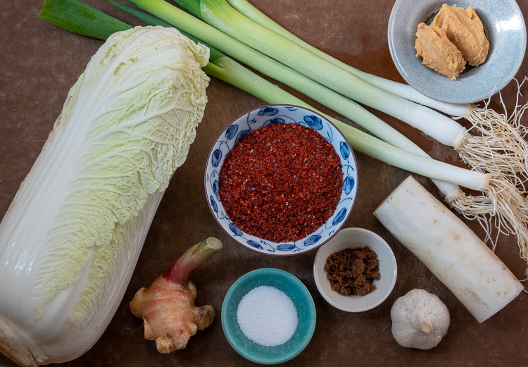
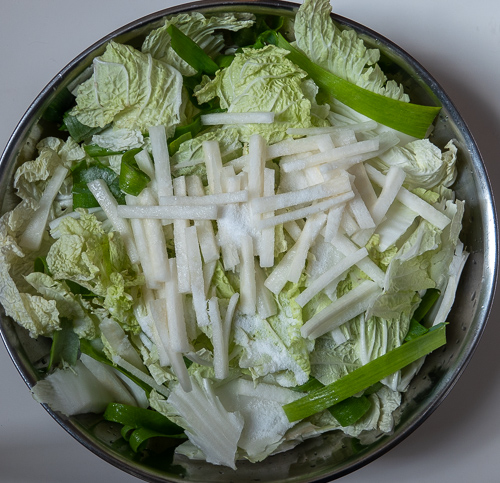
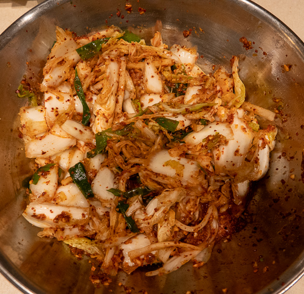

You might say I caught the fermentation bug from kimchi.

Salty, spicy, sour, with a slightly crunchy edge, this staple of Korean cuisine makes a deliciously addictive addition to everything from fried rice to tacos to sourdough pancakes to grilled cheese sandwiches.

You can buy small jars of artisanal versions for upwards of $10. I'm here to tell you it's easy--and satisfying--to make at home.

The active prep time is minimal. But with all the resting/fermenting required, it'll be four days at the very least until you have kimchi that's ready to eat. The ingredients are: Napa cabbage, daikon (Japanese radish), scallions, ginger, garlic, salt, sugar, plus a Korean a hot red pepper powder called [gochugaru](https://amzn.to/33qLvLl) (available at specialty stores such as [Kalustyan's](https://foodsofnations.com/) here in NYC and also online). Traditional non-vegan recipes include fish sauce and dried shrimp.

<figure>

<figcaption>

Vegan kimchi ingredients: Napa cabbage, ginger root, scallions, daikon, garlic, salt, sugar, gochugaru.

</figcaption>

</figure>

Kimchi relies on the same probiotic (human-friendly) bacterium for its fermentation as [sauerkraut](https://www.culturednyc.com/whats-fermenting-union-square-greenmarket-sauerkraut/): _lactobacillus acidophilus_. The bacteria are naturally present on the cabbage leaves and just need a little encouragement. That encouragement comes in the form of salt and being packed tightly in a container deprived of oxygen. Both of these things kill off the competing (human-unfriendly) bacteria, giving the _lactobacillus acidophilus_ freedom to take over. (If you're interested in reading more about the subject, I highly recommend books by [Sandor "Sandorkraut" Katz](https://www.wildfermentation.com/).)

I made my very first batch of vegan kimchi three years ago. I'd never tried my hand at making any fermented foods before and, to be honest, felt a little apprehensive about adding dried shrimp to something that was going to be sitting unrefrigerated on my kitchen countertop for over 24 hours. Plus shrimp and the fish sauce were just another two ingredients I'd need to buy. I decided to try a vegan recipe instead, and found a great one from J. Kenji López-Alt at [Serious Eats](https://www.seriouseats.com/recipes/2012/01/homemade-vegan-kimchi-recipe.html). It's possible to simply skip the seafood and leave it at that. But he substitutes miso paste to give the finished product extra tasty umami depth.

I'm a much more confident home fermenter now, but am hooked on this vegan version of kimchi (one day I'm going to try the shrimp). I make it regularly, and over the years have adjusted the ingredients and prep method slightly to my preferences. Traditional recipes call for whole Napa cabbage leaves--or, for larger batches, an intact, whole head of it, with the seasonings packed between the leaves (cool video [here](https://www.instagram.com/p/B4Y8m1wBHuX/)). But I found tearing the leaves into smaller pieces made them easier to handle every step of the way. They were easier to salt, easier to mix with the chili paste, and easier to pack in--and pull out of--jars.

I also learned the measurements don't need to be exact. If you only have three scallions on hand instead of six, three scallions will do just fine. Same goes for garlic and ginger--and the hot pepper. You even have some leeway with the amount of salt. As for the countertop fermentation, 24 hours is a basic minimum, but in cooler weather I let it go for about 36. The kimchi will get more and more sour as the process goes on. Once it's in the fridge, fermentation will continue but at a much slower rate. Feel free to adjust to your own tastes.

## Vegan Kimchi

(adapted from J. Kenji López-Alt at [Serious Eats](https://www.seriouseats.com/recipes/2012/01/homemade-vegan-kimchi-recipe.html))

- 1 head of Napa cabbage (1-2 lbs)
- 2-3 tablespoons non-idodized salt (kosher or sea salt)
- 6 scallions, trimmed, greens separated from white parts, and cut into 2-3 inch lengths
- fist-sized piece of daikon (Japanese radish), peeled and cut into matchsticks approx. 1/4 inch thick
- 5 cloves garlic, peeled
- 2-inch knob of fresh ginger, peeled and chopped coarsely
- 1/2 cup gochugaru (Korean red pepper powder)
- 2 tbs miso paste (I used low sodium)
- 1 tbs sugar (I used dark brown but any kind will do)
- water

Remove core from bottom part of Napa cabbage. Tear leaves into small pieces and place in a large bowl. Add scallion greens and daikon matchsticks. Add salt a little at a time to bowl, mixing to distribute among the leaves. Cover with a cloth and allow to wilt for 6-12 hours. Stir as needed to redistribute salt. The vegetables should release 1/4-1/2 cup water.

In a food processor, combine scallion whites, garlic, ginger, gochugaru, miso, and sugar. Whir for a few seconds to form a coarse paste.

Combine paste with the cabbage mixture in a bowl. Add 1/4 cup of water and either stir with a spoon or knead with hands until the paste is evenly distributed. Taste for desired saltiness and adjust as necessary. Pack into a large jar, pressing down with the back of a spoon to release any trapped air pockets and allow some liquid to rise to the surface until the vegetables are completely submerged. Tighten lid on jar.

Allow to sit at room temperature 24-36 hours. Open jar after 12 hours or so to release gasses. Place in fridge. Can be consumed in 48 hours and keeps for a month or two. Note: Kimchi will become softer and more sour as time goes on.
