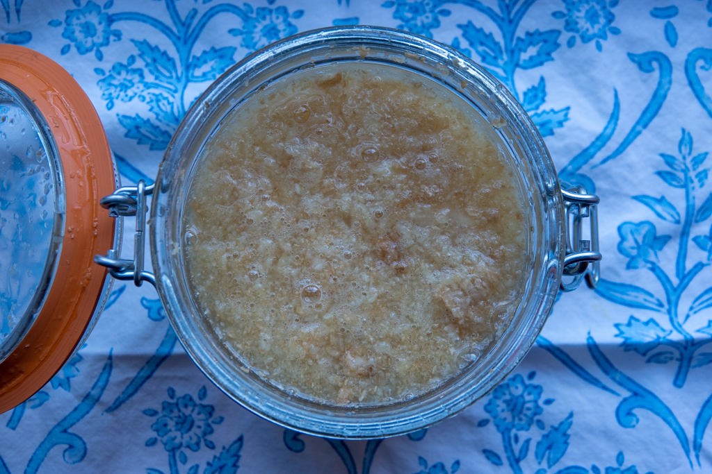
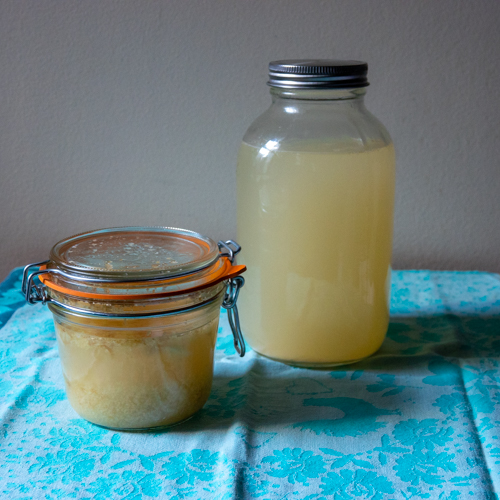
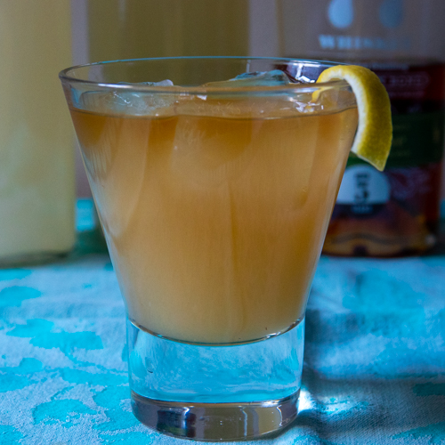

> “Give me a whisky, ginger ale on the side. And don’t be stingy, baby!”

And with that drink order, Greta Garbo spoke her first ever line in a talkie, 1930’s _Anna Christie_. “Garbo Talks!” screamed the ads! It was a big deal. So we also see that whisky and ginger ale is a classic combination. And with good reason: the burn of the ginger acts as a counter-irritant (as William Powell’s [Godfrey](https://www.imdb.com/title/tt0028010/) would say) to the burn of the booze, and the sweetness of the mixer gives the whole drink a nice lift.

My own connection with the drink is, however, much more personal: it was my Dad’s drink. He would have them when company was over, but I think his favorite time to have them was on the weekend, watching hockey games on TV. I was a precocious kid, and I learned at an early age, probably nine or ten, how to make them for him. My parents had these fancy tumblers with gold trim; there was a ring around each glass near the bottom, which I figured was the right fill line for the whisky. I’d then fill it up with Canada Dry ginger ale, no ice. I remember the first time I made him one, he approached the drink with caution, took a sip and then with a somewhat surprised expression, proclaimed it good. After that, for the next few years anyway, I would mix him the odd one while he watched those hockey games. Now I know that there will be people who are perhaps appalled at the thought of a young child mixing drinks for their father. That’s fine, but I really don’t care. It’s but one of many nostalgic memories I have of my father, who left this Earth in 2002.

In Canada, up through the 90s at least, which is when I left Ontario for NYC, Rye and Ginger is a popular drink. And ‘Rye’, in that context refers to Canadian whisky, which is very different from an American straight rye. My Dad didn’t really have a preference, I remember seeing Crown Royal (with the cool bag), Canadian Club, Seagram’s VO, and Seagram’s Five Star (with the cool plastic "sheriff’s badge"). I suspect that in the years since I left, Rye and Ginger may have become somewhat of an old man drink.

For my own version today, I’m going to skip the Canadian whisky and opt instead for an excellent NY state rye, [Breuckelen Distilling](https://brkdistilling.com/) bottled in bond small batch. And I’m also subbing in my own house-made fermented ginger beer-- recipe to follow soon! My current batch of ginger beer isn't super carbonated yet (it's only been going for two days), but it has a lovely yeasty, slightly funky, honey and spice flavor profile. If I were served this blind, I would not guess in a million years that this is a two-ingredient drink.

## Ingredients

- A shot of rye whiskey
- Ginger beer
- Serve in a tumbler, on the rocks, or neat like my Dad liked

<figure>

<figcaption>

Ginger bug, like a sourdough starter for ginger beer.

</figcaption>

</figure>

## Variations

For a classic Rye and Ginger, use Canadian whisky and commercial ginger ale. To make a Horse’s Neck, substitute brandy (classic) or bourbon (another variation), serve on the rocks and garnish with a long lemon twist, extending outside the rim of the glass.

Here’s to you, Dad!

- <figure>
    
    
    
    <figcaption>
    
    Ginger bug and fermenting ginger beer
    
    </figcaption>
    
    </figure>
    
- <figure>
    
    
    
    <figcaption>
    
    A classy riff on Rye and Ginger.
    
    </figcaption>
    
    </figure>
