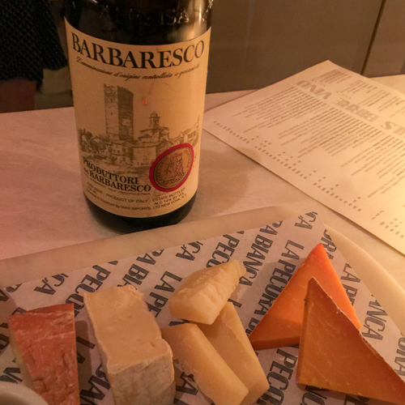
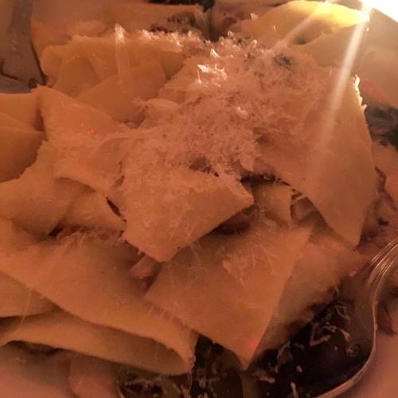
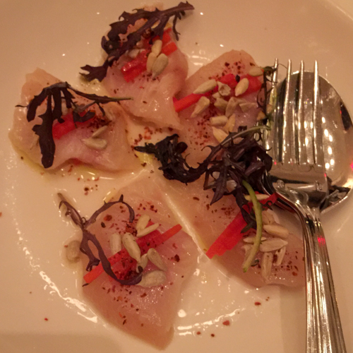
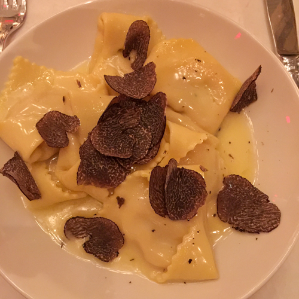
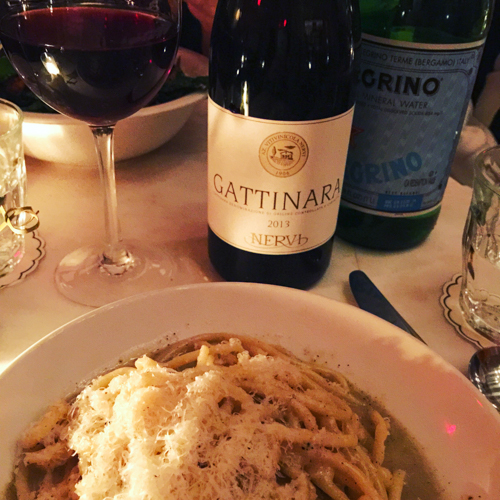

After [debuting its first location in NoMad](https://www.nytimes.com/2015/07/29/dining/la-pecora-bianca-joins-the-italian-crowd.html) in 2015, the Midtown East branch of [La Pecora Bianca](https://www.lapecorabianca.com/location/midtown/) opened with some neighborhood buzz in October 2017. I recall chatting about it in expectation with the folks across the street at [Somm Time](https://www.sommtimewinebar.com/) just before opening. In the weeks afterward, it turned into somewhat of a hang for the somms, and it did for us too! The restaurant would feature locally-sourced produce and meat, pastas made with ancient and whole grains, and an Italian wine list. I have to admit that the first thing that caught my eye on the menu was [Produttori del Barbaresco](http://www.produttoridelbarbaresco.com) by the glass. I had a feeling right then that this could be our kind of place.

We booked a table during opening week. Dining at a restaurant during opening is always interesting, because it’s not a question of whether things will go wrong—they will!—it’s a question of how the staff will handle them. On this night, our only tribulation was a bit of a wait for our table, and for this trouble we were offered a nice cheese plate as we waited by the bar. They passed the test with flying colors!

Since then, Pecora has found its way into our regular rotation. The food here is what you might call mainstream modern Italian. This is neither fine dining, nor old-school, but it’s good, and it leans healthy. We have sampled salads, pastas, fish and seafood, and while there haven’t been any dishes that we dream about at night (hello cacio e pere at [Felidia](https://felidia-nyc.com/)!) everything is good enough to keep us coming back, the pastas in particular. I was pleased to see a bucatini cacio e pepe, previously a special, make it to the regular menu. Arancini have been on the menu since opening. While Pecora no longer offers Produttori by the glass, there is almost always a good Produttori, sometimes a reserve, available by the bottle, along with other solid Brunellos and Super-Tuscans. Cocktail service is good, and they pass the Plymouth gin test.

The main dining area is rather large, on the bright side and with a volume level approaching high (although nowhere near the cacophony of the nearby [Smith](https://thesmithrestaurant.com/location/midtown/)). These are not our favorite attributes for a dining room, but somehow Pecora makes it all work. This is a very solid choice for entertaining out-of-town guests. Breakfasts and brunches, during which the scene is not as lively as dinner, are also good options.

- <figure>
    
    
    
    <figcaption>
    
    October 2017
    
    </figcaption>
    
    </figure>
    
- <figure>
    
    
    
    <figcaption>
    
    October 2017
    
    </figcaption>
    
    </figure>
    
- <figure>
    
    
    
    <figcaption>
    
    December 2017
    
    </figcaption>
    
    </figure>
    
- <figure>
    
    
    
    <figcaption>
    
    December 2017
    
    </figcaption>
    
    </figure>
    
- <figure>
    
    
    
    <figcaption>
    
    May 2018
    
    </figcaption>
    
    </figure>
    

## Details

La Pecora Bianca  
950 2nd Avenue, New York, NY 10022  
[https://www.lapecorabianca.com/location/midtown/](https://www.lapecorabianca.com/location/midtown/)  
(212) 899-9996
