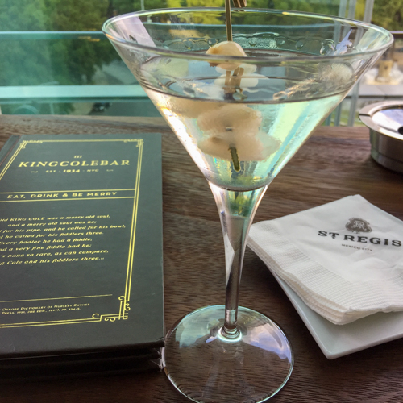

If you asked [Doug Quinn](https://www.nytimes.com/2010/05/28/dining/28bruni.html), owner and bartender at Midtown East’s [Hudson Malone](http://www.hudsonmalone.com/), what my drink is, he’d probably say, ‘rye Manhattan.’ And it’s true, I do order a lot of those, and it’s even the drink we chose to launch this column. But I’ve always had a lot of drinks in the rotation, mostly sticking to the classics. That is, unless I’m at one of my favorite craft cocktail joints like [Amor Y Amargo](https://www.amoryamargony.com/) in New York, or [Stagger Lee](http://www.staggerlee.de/) in Berlin. In that case, I’ll gladly let their list of in-house specialties map the way. However, if you were to ask the same question of [Tom Dillon](https://www.irishtimes.com/news/the-king-of-new-york-1.112938), my friend who is also the lunch service bartender at [La Grenouille](http://la-grenouille.com/), he would unhesitatingly answer, ‘Oh, that’s easy—a Plymouth Gibson.’ And now that I think of it, that is almost always my first order when Tom and I are out. Increasingly, over the years, it has become my go-to cocktail.

- <figure>
    
    
    
    <figcaption>
    
    21, NYC, January 2014
    
    </figcaption>
    
    </figure>
    
- <figure>
    
    
    
    <figcaption>
    
    Hotel Bristol, Warsaw, June 2015
    
    </figcaption>
    
    </figure>
    

[Nora](https://www.culturednyc.com/author/nora-maynard/) and I got seriously into cocktails in the early 90s. It all started with our love of classic film. We would be watching the Thin Man, or My Man Godfrey, and want to have ‘what they were having.’ This was well before the 21st century cocktail renaissance, and so at that time, classic, well-proportioned cocktail glasses resembling those used in the films were not easy to come by. Enter Bombay Sapphire, with a holiday season gift set consisting of a bottle of gin, and two small, nicely proportioned cocktail glasses. We kept buying these gift sets for ourselves, and eventually had enough of the glasses to throw cocktail parties at our place. Along the way, I developed a new appreciation for gin. Up until that point, gin for us had mostly meant Gordon’s, and had mostly been consumed in G&T form.

- <figure>
    
    
    
    <figcaption>
    
    American Bar, Savoy Hotel, London, March 2016
    
    </figcaption>
    
    </figure>
    
- <figure>
    
    
    
    <figcaption>
    
    Envoy Hotel, Boston, October 2016
    
    </figcaption>
    
    </figure>
    

Gin martinis continued to rank high on my cocktail list through the aughts, and for some reason, when I think of NYC in the aughts, I think of Bombay Sapphire. Also in the aughts, Nora was writing a great column on food and drink in film, called [The Celluloid Pantry](https://www.thekitchn.com/collection/the-celluloid-pantry). One of her posts was on [The Gibson cocktail in the film All About Eve (1950)](https://www.thekitchn.com/the-celluloid-p-21-9827). Throughout the pivotal party scene, Bette Davis brandishes the cocktail as a dramatic prop. Most famously, Davis downs a Gibson, skips eating the onion garnish, and delivers the line, “Fasten your seat belts, it’s going to be a bumpy night.” (Nora also used this wonderful scene in her popular Classic Cocktails, Classic Film lecture and demonstration series.)

Earlier in that same scene, Gary Merrill hands Celeste Holme one of the cocktails delivers the line, “Karen--you’re a Gibson girl.” This is a nod to [Charles Dana Gibson](https://www.illustrationhistory.org/artists/charles-dana-gibson), the illustrator whose “Gibson Girls” were featured in prominent magazines in the early 20th century. As the story goes, Gibson invented his namesake cocktail, essentially a gin martini with a pickled onion as garnish, in New York at [The Player’s](http://theplayersnyc.org/) club. This is where Tom Dillon re-enters the story, as Tom recently explained to me that the correct number of cocktail onions in a Gibson is two, in an anatomical homage to the Gibson Girl. You get the idea.

And so, perhaps inspired by the film, The Gibson started displacing the martini as my favorite gin cocktail. Unlike Davis, I always eat the onions, which I think is a perfect way to whet the appetite for whatever is coming next. In fact, eating the onions really sets you up too well for ordering another Gibson, which for me is a no-no, so I have now taken to eating the garnish midway through the drink. Uncharacteristically, I prefer store-bought cocktail onions to artisanally house-pickled ones, mainly because of the size—craft bar house-pickled onions tend to be too large, which spoils the proportions of the drink.

The final piece in the puzzle is the matter of the gin. On the heels of the 21st century cocktail renaissance came a distilling renaissance, which we are still enjoying today, at the end of the 'teens. Over the years, we have sampled many small production gins with flavor profiles all over the map. The problem for me was that, as interesting as these gins are when sampled solo, they tend to make for pretty monstrous martinis. In the course of sampling all these gins, we rediscovered Plymouth gin. Compared to Bombay Sapphire, it’s a little more rounded, a little less juniper-forward. And for reasons that I don’t quite understand, Plymouth is very forgiving to different levels of vermouth, whereas with Bombay, I feel the need to really dial it in to get a well-balanced drink (an under-vermouthed, or under-diluted Sapphire martini is not pleasant). And so Plymouth became the new standard for me, not to say that I dislike any of the big London Dry gins. In fact, I now regularly employ what I call the Plymouth test, with the simple rationale that if a bar doesn’t carry Plymouth, perhaps it’s not the best place to order a gin cocktail.

- <figure>
    
    
    
    <figcaption>
    
    St. Regis, Puerto Rico, January 2017
    
    </figcaption>
    
    </figure>
    
- <figure>
    
    
    
    <figcaption>
    
    St. Regis, Mexico City, September 2017
    
    </figcaption>
    
    </figure>
    
- <figure>
    
    
    
    <figcaption>
    
    Lunch at La Grenouille, February 2018
    
    </figcaption>
    
    </figure>
    
- <figure>
    
    
    
    <figcaption>
    
    Pierre Hotel, NYC, July 2018
    
    </figcaption>
    
    </figure>
    
- <figure>
    
    
    
    <figcaption>
    
    Hotel Imperial, Vienna, September 2018
    
    </figcaption>
    
    </figure>
    
- <figure>
    
    
    
    <figcaption>
    
    Hotel Prince de Galles, Paris, September 2018
    
    </figcaption>
    
    </figure>
    

_We would like to humbly dedicate this post in memory of inspirational educator, cocktail writer, and bartender, [Gary Regan](https://www.winemag.com/2019/11/22/gaz-regan-bartender-legend/), who died last Friday._
