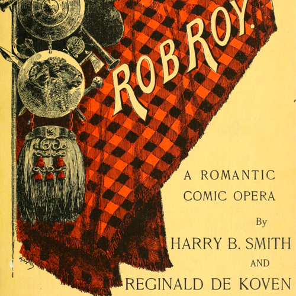
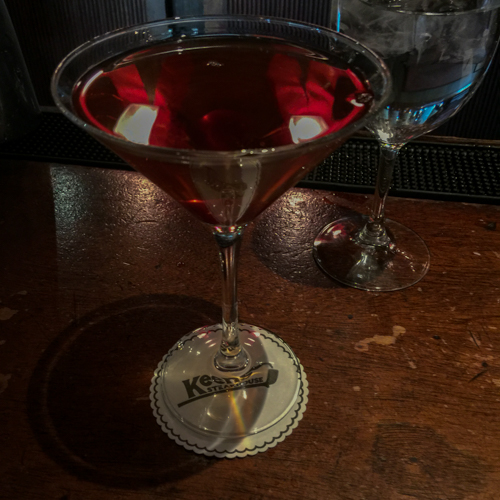
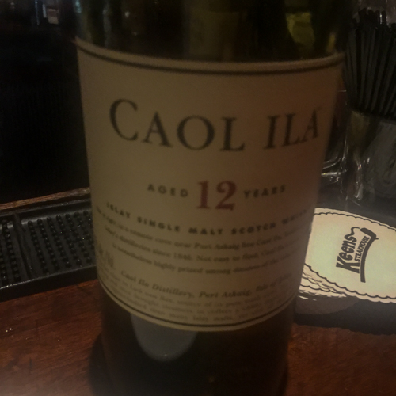

## Louis & Wally

Did you know that Ludwig van Beethoven (1770-1827) and Walter Scott (1771-1832) were contemporaries? Even If you are not a classical music buff, you may have lately noticed more and more references to Beethoven popping up around you. Well please get ready, because you will see more and more Beethoven over the next year, as December 16 2020 will be the sestercentennial, or 250th, anniversary of his birth. Or so we assume, since we don’t know definitively on what day Beethoven was born, only the day of his baptism, which was December 17 1770, in Bonn, Germany. Even Beethoven didn’t know his own birthday, and at one point he asked his pupil, friend, and later, biographer, Ferdinand Ries, to do some research to help him figure it out. Scott will have his sestercentennial a year later, in 2021, and we in the US will have our country’s five years after that.

I don’t know of any definitive connection between Beethoven and Scott, other than the fact that Scott had an interest, in his younger days, of German Romantic literature, and that Beethoven set three of Scott’s poems as part of his 25 Scottish Songs, Op. 108, first published in 1818. At that time, Beethoven was one of the world’s most famous composers, well into his “late” period, and composing some of the greatest instrumental music ever written. So why the Scottish folk songs? Well, in a word, money. Despite his fame, money was always a problem for Beethoven, and there was not a single point in his life where he could settle down and stop the hustle. The song settings paid fairly well, and were easy and enjoyable work for him. (They are worth listening to; they’re quite beautiful.)

Late in his life, Scott had money problems too, although his trajectory was entirely different from Beethoven’s. Scott was born into nobility and had a steady day job as a Writer to the Signet (a kind of solicitor) among other things. He began his professional writing career in 1796 with a translation of German ballads. Later the same year, he published his first poems. By 1805, his poems had reached international acclaim. (Beethoven at this point was four or five years into his mature “middle period.”) In 1814, Scott published, anonymously, his novel Waverley, historical fiction about the Jacobite rising of 1745. Waverley was a smash, and over the next 18 years, Scott published 20 more books which have come to be known collectively as the Waverley Novels. The novels brought Scott substantial wealth, but the money problems still came for him. In 1825, the publishing company in which he was a partner went bust. Scott took it upon himself to write his way out of his debts, publishing over the next seven years a non-stop stream of novels, plays, and non-fiction.

All-in-all, Scott’s collected works make for a very impressive leather-bound set. Judging by the number of these sets from the late 1800s that are still around in New York City, they seem to have been quite popular among the type of families who could afford to purchase them, and also to afford to keep them around in good condition for 150 years. At this moment, [Argosy Books](https://www.argosybooks.com) has available a set of the [Waverley Novels](https://www.argosybooks.com/advSearchResults.php?orderBy=saleprice2&action=search&cat_conj=or&keywordsField=walter+scott) in a centenary edition from 1871, 25 volumes and a comparative bargain at only $950. A fancier edition from 1877 in 48 volumes is currently available for $4,000. We can deduce from all these collected works sets that Scott was popular in New York City. But we also have more direct knowledge: in 1833, 6th Street in Greenwich Village was renamed Waverly Place in Scott’s honor. Pity they spelled “Waverley” wrong, but oh well, you say “whiskey,” I say “whisky.”

## Succession, 1890s Style

If you were a New Yorker in the 1890s and had the cash, not to mention the shelf space, for a 50-volume leather-bound set of the works of Walter Scott, you were probably the type of clientele that William Waldorf Astor had in mind when he opened his Waldorf Hotel at Thirty-third Street and Fifth Avenue in 1893. On February 13 of that year, the New York Times raved: “This hotel is a palace. The new Waldorf Hotel is soon to be opened. Its cost over $3,000,000. Fortunes expended upon a single room—a thirty-five hundred dollar bed. Plans for a grand opening next month.” Browsing through the Times archive of the subsequent months, you see many stories on the Waldorf—interesting ones that probably merit a post of their own. But then on November 3, 1893, a bombshell hits. “It will tower above the Waldorf; John Jacob Astor to build a hotel adjoining that of his cousin. An eighteen-story hotel is to be built by John Jacob Astor on the southwest corner of Fifth Avenue and Thirty-fourth Street, adjoining the Waldorf. If expectations are realized, it will be the largest, best equipped, and in most luxuriously appointed hotel in the world.”

The story reads:

> “When William Waldorf Astor put up the Waldorf on his part of the old Astor homestead, it was rumored that the other branch of the family was not exactly pleased, and that its members would continue to live in their brick house at Thirty-fourth Street and Fifth Avenue, right next door. The Waldorf has prospered however, and John Jacob Astor some time ago decided to go his cousin one better in the hotel line.”

Family intrigue! Extreme wealth! Cousins making power moves just to piss each other off. Yes, this is the 1890s version of Succession. At the end of the Times story, they announce that John Jacob Astor had chosen a name for the hotel, “a capital one” at that, but he would not yet reveal it. Well, of course, he named it the Astoria Hotel. The Astoria opened in November, 1897, the Astor family having decamped from their brick house way uptown to Sixty-fifth Street and Fifth Avenue. The two hotels were at first operated separately, but both under the same general manager, George Boldt. But soon thereafter, they were combined into a single hotel, with a “Peacock Alley” skyway connecting the two properties above Thirty-third Street. The combined hotel became the Waldorf-Astoria, with the hyphen symbolizing the peacock alley. When Conrad Hilton bought management rights to the new Waldorf-Astoria (the old one was razed in 1929 to make way for another folly, the Empire State Building), he changed the hyphen to an equal sign, making the reference to the old skyway that much more explicit. Hilton dropped the hyphen in 2009, which is a pity.

## Oh Promise Me

Not far from the original Waldorf, the Herald Square Theatre opened at 1333 Broadway in 1883. Herald Square was, of course, the home of the New York Herald, a sort of Fox News for its age, and which would later become the Herald Tribune. The two famous squares on Broadway, are actually “bowtie” squares, each consisting of a pair of squares: Herald & Greeley, and eight blocks uptown, Times & Duffy.

Composer Reginald de Koven had his first smash hit in New York with the operetta Robin Hood, which, after debuting in his native Chicago in 1890, opened the next year in the Manhattan Theatre, just down the street across from Greeley Square. The Times gave the show a very good review, and one tune, “Oh Promise Me” has survived, becoming for a time a popular sappy song to sing at weddings. If you were a fan of All in The Family, you may recall the episode in which Edith Bunker, much to Archie’s chagrin, gives us her version of the tune.

Looking for another hit, de Koven settled upon Rob Roy for more Robin Hood-ish action. I don’t know to what extent de Koven or librettist Harry Smith were inspired by Walter Scott’s novel, but certainly the novel would lend an air of rich-mahogany-many-leatherbound-books respectability to the affair. How to describe de Koven’s music? I guess calling it second-tier Gilbert and Sullivan would get you in the ball park. The rhythms are square, the harmonies are square, the tunes are written so that you can hum along the first time you hear them. There don’t seem to be any recordings in print, but Naxos did a well-produced recording of Robin Hood in 1981, many selections from which can be found in the usual places. I’ve leafed through the score of Rob Roy, and it certainly doesn’t seem to be any better, and the Times review would indicate that it didn’t quite reach the heights of Robin Hood.  

Nonetheless, the show was a hit, running at the Herald Square Theatre through March 1894. And so, to celebrate the hit show running around the corner, one of the bartenders at the Waldorf came up with a show-themed cocktail, and the Rob Roy was born.

## The Damn Drink

If Rob Roy the operetta is the red-headed stepchild of Robin Hood the operetta, I don’t think you could quite say the same about Rob Roy the cocktail in relation to the Manhattan. True, that’s the easiest way to conceive of a Rob Roy--as a Manhattan with scotch whiskey subbed for rye. And that’s undoubtedly how the drink’s originator came up with the idea. But since the world of scotch whiskey is so vast, this drink can go in a million different directions, some of which are amazing. Mixing one up with a relatively neutral blended whiskey, like Famous Grouse for example, and you have not strayed too far from Manhattan town. Going with a single malt that is balanced but with some nice peat, say a Glen Morangie, or a Cardhu, and now you are really venturing into new territory. How about with a peat bomb from Islay like a Lagavulin or a Laphraoig? Off the Island for sure!

There is also a wide range of tuning to be made on the vermouth dial. Fin de siècle cocktails were sweeter than current tastes call for, a 1:1 ratio of whiskey to vermouth would be the starting point. Personally, I prefer my whiskey cocktails much drier and would more likely aim for 3:1 or even 4:1. As I noted in my post about the [Old Pal](https://www.culturednyc.com/friday-at-five-old-pal/) vs. the Boulevardier, the white vermouth or perfect (white and sweet vermouth) versions are worth checking out.

And lastly, there’s the dash. Angostura bitters is the standard, but there is an argument to be made for Peychaud’s. And what if you skip the bitters altogether and opt for a dash of something sweet, like Benedictine, or Drambuie? Well, you’re on to something there, but that’s a topic for next time!

One last question remains, and that is, where to drink one? The original Waldorf bar disappeared 90 years ago, the current Waldorf Astoria is closed, the Oak Bar is still closed. Well, it turns out there is still a great old place to enjoy a Rob Roy in period setting. It hails from 1885, predating with Waldorf and the operetta. And better yet, it is right around the corner from the original Waldorf and the Herald Square Theatre. I’m of course talking about [Keen’s Steakhouse](http://www.keens.com/). It’s perfect, and in fact, I went back yesterday just to be sure of it.

At Keen’s, I tried two different Rob Roys. For the first, I was looking for a ‘straight down the middle’ blended scotch. They had just run out of Famous Grouse, so we went with Cutty Sark instead. We went 3:1 on the vermouth, and Angostura bitters. It was good, and would serve well as an evening opener. For the second, I wanted to try out a really peaty single malt. We went with Caol Ila, and this was a really good choice: it’s peaty but without the iodine, medicinal qualities of some other Islay malts. We also went sweeter with the vermouth on this one. Hugely different! I don’t think this would be my favorite way to start an evening, but I very well could see myself enjoying one of these by a fireplace as a night cap.

- 
- 
