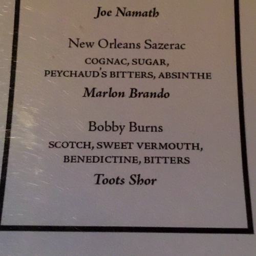
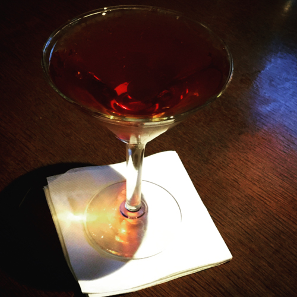
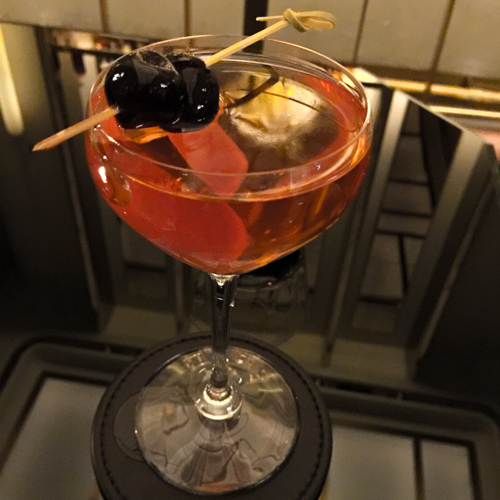
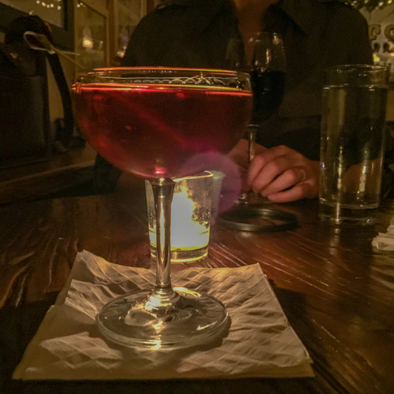

Towards the end of my post on the [Rob Roy](https://www.culturednyc.com/friday-at-five-rob-roy/), I pondered swapping out the bitters in the drink for something sweet, like Benedictine, or Drambuie. Now we will take up that thread as we continue our look at Scotch whiskey cocktails for December. I have known about the Robert Burns and Bobby Burns cocktails for as long as I have known about the Rob Roy, and that is a long time. But I’ve always been a little bit hazy on the details of these drinks, and it turns out, that’s understandable.

To begin with, one can’t be blamed for assuming that the Robert Burns is named after the great Scottish poet. But in an early reference to the drink, in the Old Waldorf-Astoria Bar Book (1935), Albert Stevens Crockett writes:

> “It may have been named after the celebrated Scotsman. Chances are, however, that it was christened in honor of a cigar salesman, who “bought” in the Old Bar.”

Crockett lists the recipe as follows:

## Robert Burns

- Dash of Orange Bitters
- One dash of Absinthe
- One-quarter Italian Vermouth
- Three-quarters Scotch Whiskey

Compare this to his recipe for the Rob Roy, just down the same page:

## Rob Roy

- Dash of Orange Bitters
- One-half Scotch
- One-half Italian Vermouth

So, it’s like a drier version of a Rob Roy, with the addition of absinthe. (Also, recall that the Rob Roy is meant to be a red drink, in honor of its red-headed namesake.) But was Crockett just kidding around about the cigar salesman? Well, I wonder, because here’s what Harry Craddock wrote five years earlier in The Savoy Cocktail Book (1930):

## Bobby Burns Cocktail\*

- ½ Italian Vermouth.
- ½ Scotch Whisky.
- 3 Dashes Benedictine

“\*One of the very best Whisky Cocktails. A very fast mover on Saint Andrew’s Day.”

So at the very least, people drinking in the American Bar at the Savoy thought that the drink had Scottish significance. Let’s take a look at what David Embury wrote about the drink in The Fine Art of Mixing Drinks (1948).

> “Rob Roy – Made exactly like the Manhattan but with Scotch in place of the rye or bourbon. If orange bitters are used instead of Angostura, the drink is sometimes called the Highland, or the Highland Fling, or the Express. An interesting variation on the Rob Roy is the Bobbie Burns.
> 
> Bobbie Burns – Rob Roy with the addition of 1 dash of Drambuie for each drink. Benedictine is sometimes used in place of the Drambuie. However, the Drambuie is preferable because it is made with a Scotch whisky base.”

So, where does that leave us? Well, to list everything, we are in doubt of the drink’s name, provenance, bitters-yea-or-nay, absinthe-yea-or-nay, Benedictine-vs-Drambuie, whiskey-to-vermouth. Given all the above, my assumption was that this would be another cocktail I would need to explain to every bartender. And that turned out to be incorrect! As a matter of fact, on my first outing on the trail of this drink, I went to [Hudson Malone](http://www.hudsonmalone.com/). I asked the bartender if he knew how to make a Robert Burns, or a Bobby Burns. And he said, ‘Oh yeah, the Bobby Burns is on our cocktail list!’ Well, there you go again, Doug Quinn for the win! I ordered the Bobby Burns and sampled it. Hmm. Pretty good, but it was not going to be my favorite. I asked which whiskey they were using, and it turned out to be a rail brand, whose name I shall not utter here. For round two, I asked for Famous Grouse, and Drambuie in place of the Benedictine. Also some arancini to help maintain my critical focus. Yes! This one works—quite decidedly.

<figure><figcaption>Bobby Burns cocktail on the menu at Hudson Malone.</figcaption></figure>
<figure><figcaption>A Bobby Burns at Hudson Malone</figcaption></figure>

For my next Robert Burns, I enjoyed one pre-diner at [Bar Shun](https://shun-nyc.com/). A quick explainer to the bartender and we were off to the races. This was also very good, with much restraint on the sweet notes, and great balance. Swanky even, to match the swanky room. I had another Robert Burns at [The Blasket](https://www.theblasketpub.com/), which is a very nice Irish pub very close by. We were meeting our friend Liza Weisstuch. Liza is a whiskey expert and Guinness lover, so The Blasket was a good choice. The bartender, Liam, made me a fine Robert Burns. I asked him which Scotch he liked in cocktails like these, and he simply replied, “I don’t really like Scotch.” Fair enough!

<figure><figcaption>A Robert Burns at Bar Shun</figcaption></figure>
<figure><figcaption>Robert Burns cocktail at The Blasket</figcaption></figure>

## My Robert Burns

- ¾ Scotch whiskey (Johnnie Walker Black or Famous Grouse)
- ¼ Italian vermouth
- Few dashes Drambuie
- One dash absinthe
- Stir and serve up with maraschino cherry

My original plan was to enjoy these drinks on the outside, as I didn’t much feel like investing in Benedictine or Drambuie. However, I broke down and picked up some of the latter. When I brought it home, Nora dryly intoned, “welcome to the bottle of Drambuie we will have for the rest of our lives.” But I don’t think that is going to be the case. It’s very sweet on its own, but when paired with whiskey, something magical happens. I found myself making these drinks at home much more often than strictly required for research purposes. In fact, I think the Robert Burns is getting an official spot in the rotation. Next time, we will wrap up the year with a look at another classic Scotch and Drambuie concoction.
