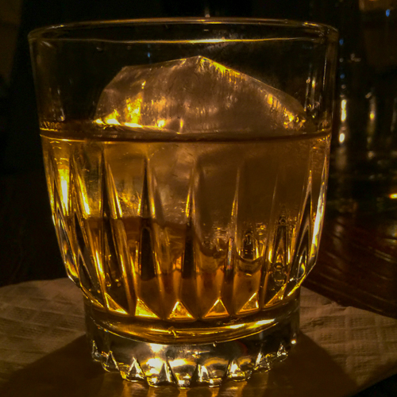
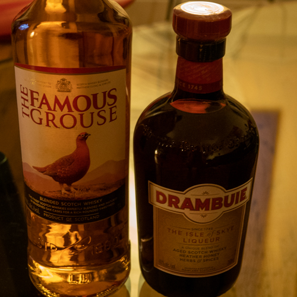

Is there such a thing as an “old man drink?” In the early 90s, we were in our 20s, and into cocktails. Although this predates the canonical “cocktail renaissance,” you could still find cocktails in Toronto. For the most part, the cocktails you were likely to encounter fell into three categories: 70s singles bar cocktails, contemporary twists on the same, a small subset of classic cocktails. Of that last group, the few classic cocktails you encountered weren’t likely to be particularly well-made. People were drinking [Manhattans](https://www.culturednyc.com/friday-at-five-rye-manhattan/), but in Toronto, they were usually made with Canadian whisky. (No doubt in part due to the confusion between Canadian rye and American straight rye. We would never make that mistake now, right?)

Another Canadian twist on a classic cocktail is the Bloody Caesar, or in Canadian parlance, a “Caesar”. It’s a take on the Bloody Mary that substitutes clamato juice for tomato juice. It has a fascinating history whose details involve a Canadian and a Polish New Yorker—I’ll save that for a later post. Being contrary, I have always preferred Bloody Marys, mostly because they were the drink of one of my all-time favorite TV characters: Olivia “Mother” Jefferson, played so brilliantly by [Zara Cully](https://en.wikipedia.org/wiki/Zara_Cully). (A “grandma drink”?)

You know what 20-somethings in Toronto weren’t drinking much? Martinis. At the time, classic Martinis had an old-man-drink vibe. To get a good one, you had to visit a place where old men hung out, like a steakhouse or a hotel bar. I distinctly remember a visit to the bar at the [Top o’ The Senator](https://thesenator.com/). There were four of us sitting at the bar and we ordered a round of Martinis. We got the Martinis and the check, unasked for, at the same time. Message received.

During that era, I remember having an after dinner drink at a wedding with the father of the groom. He was a classic old-school older gent. (Like [Alton Benes](https://www.chesterjankowski.com/lawrence-tierney-old-school-tough-guy/), although not a tough guy.) He had a Rusty Nail. I had never had one. I tried it. I liked it, even though it was sweet and I’m not a sweets person. I could probably count on the fingers of one hand how many Rusty Nails I had had since then. But since December is our Scotch cocktails month, I thought that would be a good place to wrap things up.

I began my Rusty Nail research at [Hudson Malone](http://www.hudsonmalone.com/). I asked my bartender if anyone ever ordered the drink. He laughed a bit and said, “Rusty Nail? That’s something my parents would order.” OK, some evidence to support my thesis. The question is, should we rescue the drink? For me, the answer is a resounding yes! It’s a very simple drink: scotch on the rocks with a hint of [Drambuie](https://www.drambuie.com/about-us/). Perhaps a bit sweet for an aperitif, but I like it as an after dinner drink. Really the only variability is the type of scotch and the amount of Drambuie. I’ve tried many variations over the last few weeks, and here’s where I landed.

#### Rusty Nail

- 2 oz blended Scotch whisky (Johnnie Walker Black, or Famous Grouse)
- ½ oz Drambuie
- Build in tumbler with plenty of ice

<figure>

- <figure>
    
    
    
    <figcaption>
    
    At The Blasket NYC
    
    </figcaption>
    
    </figure>
    
- <figure>
    
    
    
    <figcaption>
    
    Simple!
    
    </figcaption>
    
    </figure>
    

</figure>

_We hope you have been enjoying this series. We’re now going on a hiatus for January and will see you again later in the New Year. Please let us know in the comments if there are any cocktails you would like us to cover in future posts._
