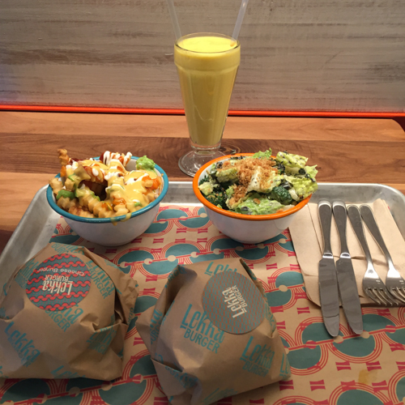
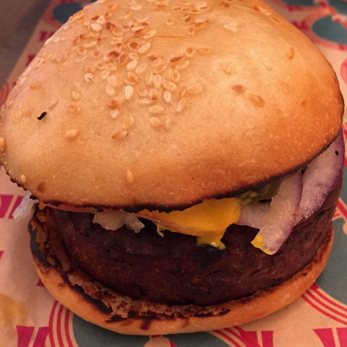
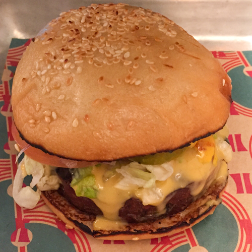
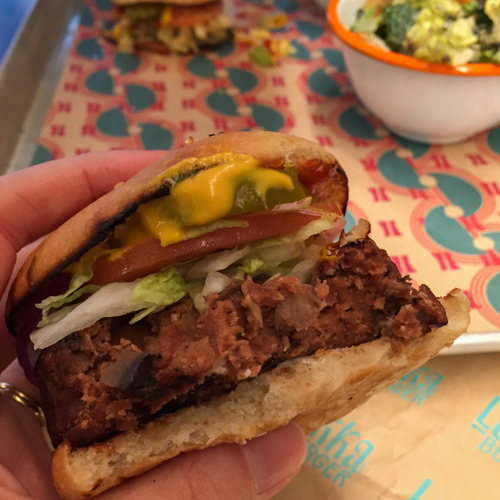
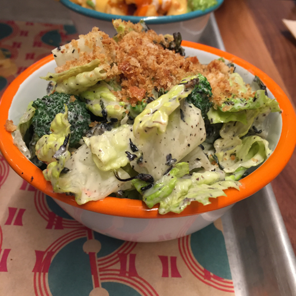

Amanda Cohen, at the helm at [Dirt Candy](https://www.dirtcandynyc.com/), is arguably NYC's top vegan chef. When we heard that she was opening a vegan burger joint in TriBeCa, we were thrilled! Today we got to try it. The restaurant is called [Lekka Burger](https://www.lekkaburger.com/), and it's at 81 Warren Street, right around the corner from Sonic Youth's old studio on Murray Street.

The menu features five different burgers, fries with various toppings, salads, shakes, and a bar. The burgers are Cohen's own secret recipe. They're quite delicious, earthy, mushroomy, umami-y, with a satisfying heft and texture. The sides were great, and we loved the mango oat milk shake--we'll try vanilla with a shot of bourbon when we go back for dinner.

<figure><figcaption>The Tray</figcaption></figure>
<figure><figcaption>Lekka Burger</figcaption></figure>
<figure><figcaption>Lekka Cheeseburger</figcaption></figure>

<figure><figcaption>Lekka Burger</figcaption></figure>
<figure><figcaption>Broccolini Caesar</figcaption></figure>
<figure><figcaption>Mango Oat Milk Shake</figcaption></figure>

    
<figure><figcaption>Messy Fries</figcaption></figure>

Cohen's partner in Lekka is South-African-born philanthropist and climate activist Andrea Kerzner. The team's focus on zero-waste is evident; merchandise sold in the store benefits Grow NYC. It’s also a nice room with a friendly vibe. We can't wait to come back!
