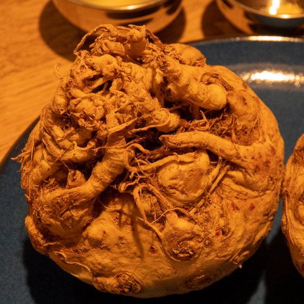
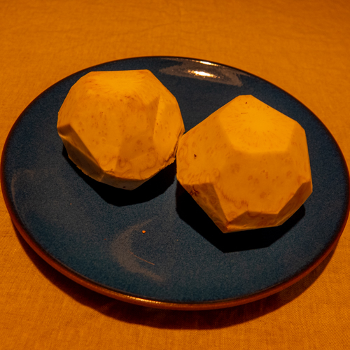
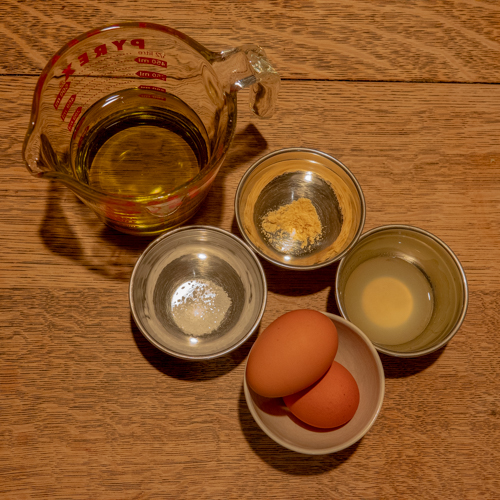
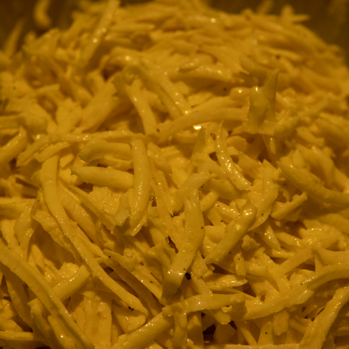

Le Veau d’Or was without a doubt our restaurant of the ‘teens. Stradling the border of Midtown East, and the Upper East Side, it was a quick stumble away. For years, we would pass by that storefront with brass sign, intrigued and yet something always held us back. Maybe we thought the menu was too meat-centric. Anthony Bourdain gave us the needed push in his 2009 “Disappearing Manhattan” episode of No Reservations. We dressed up, gulped hard, and stepped in.

I remember that first visit quite vividly. Robert Treboux, was perched on a seat at the bar with a small glass of red wine. Robert’s daughter, Cathy, was flitting about from table to table, taking orders, chatting with the regulars. “My father is melting,” she told us. We all hit it off. I liked the table we had, in the back, with a clear view of the entire room. “I really like this table, this should be our table whenever we come in,” I told Cathy. She thought about that, and then gave us a test to see if we were worthy: she showed us a postcard with a picture of a calf snoozing in a bed, cutely tucked in under the covers. Nora and I both laughed, “Ah, le veau dort!” We got the joke, we were in. We also never sat at that table again.

We bounced around different tables on our next few visits. We had the Orson Welles booth once. Then we settled in to “our table,” which was about three tables in, across from the bar. We were seated there pretty much every time we came. [Robert died in 2012](https://www.nytimes.com/2012/08/24/dining/robert-treboux-owner-of-le-veau-dor-restaurant-dies-at-87.html). Cathy of course took over, but she had already been running the place for some time. We got to know Cathy better over the years, we became friends. We loved bringing people in. We brought in our friend Liza Weisstuch, and she was so taken with the place, she wrote about it for the [Boston Globe](https://www.bostonglobe.com/lifestyle/food-dining/2015/02/03/escoffier-reigns-tiny-new-york-french-bistro/BbWgWobygWuQ6fUc6lvs4O/story.html) (those are Nora’s hands in the photo). When Cathy decided last year that it was time for her to move on and [sell the restaurant](https://ny.eater.com/2019/7/16/20696473/le-veau-dor-riad-nasr-lee-hanson-frenchette-nyc), we were of course sad to lose Le Veau d’Or, but more than anything, we were happy for Cathy.

In the Bourdain episode, he marveled that Le Veau served dishes so old-school that “no one makes this stuff anymore.” Two of those dishes became parts of our regular order: “Oeufs a la Neige” aka “Îles Flottantes,” and “Céleri Rémoulade.” When we spotted some beautiful (well, weird and wonderful) celery root at the Union Square Greenmarket last weekend, Nora and I both had the same idea: Céleri Rémoulade!

<figure>

- <figure>
    
    
    
    <figcaption>
    
    Celery Root
    
    </figcaption>
    
    </figure>
    
- <figure>
    
    
    
    <figcaption>
    
    Peeled
    
    </figcaption>
    
    </figure>
    
- <figure>
    
    
    
    <figcaption>
    
    Mayonnaise
    
    </figcaption>
    
    </figure>
    
- <figure>
    
    
    
    <figcaption>
    
    Done
    
    </figcaption>
    
    </figure>
    

</figure>

For a recipe, I turned first to our trusty 1967 edition of Mastering the Art of French Cooking, but guess what, it’s not there! I found a recipe from [David Lebovitz](https://www.davidlebovitz.com/celery-root-remoulade-celeri-rem/) online. But it turns out, you don’t really need a recipe. Céleri Rémoulade is just shredded celery root dressed with mayonnaise and Dijon mustard. So simple, and it comes together in just a few minutes. To shred the celery root, begin by trimming away the outer skin. You end up with something that looks like a dodecahedron, or a D&D die. I used the shredding disc of our trusty Cuisinart for this. (I once heard a guest at Le Veau say to Cathy, “The rémoulade is great, you must have a mandoline in the kitchen?” and Cathy replied “No darling, to tell you the truth, he just uses a food processor!”) For the mayonnaise, I was able to rely on Julia’s recipe. It was actually my first time making it, and it was also a piece of cake. I used the blender for this, but upon reflection, it would have been smarter to use the same food processor for both. We were out of Dijon mustard, so I just used some of the fine Löwensenf we had on hand. A bit of seasoning, thirty minutes in the fridge, and it was like we were back at Le Veau!
