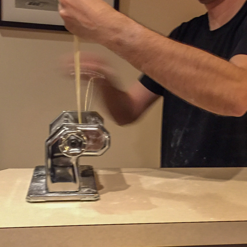
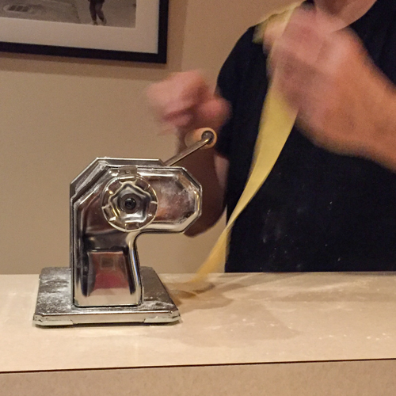
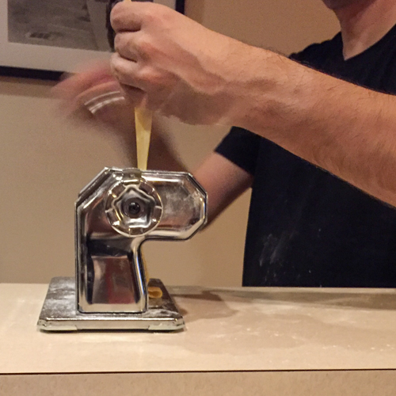
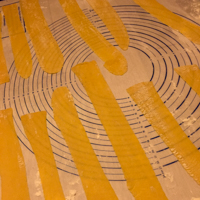
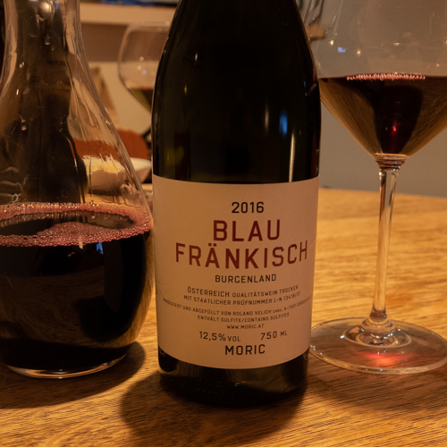
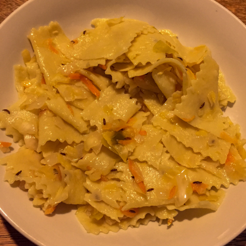

I'm sorry to say the first time I encountered krautfleckerl, I gave it a hard pass.

It was the first night of Chester's and my first visit to Vienna. We were equal parts excited, tired, and hungry. Our hotel's concierge recommended a nearby restaurant, but we neglected to tell him that we were looking for vegetarian and pescatarian options. The pickings were slim. The only fully veggie entrée on the menu consisted of pasta sautéed with cabbage and onion. (Yes, that's our krautfleckerl!) At the time, the dish seemed to me like an afterthought, something a meat-focused chef might toss together from pantry staples to accommodate the rare vegetarian diner who stopped by. I ordered the salmon.

The next day, better rested, we visited the legendary [Café Central](https://www.cafecentral.wien/en/) for lunch. With its vaulted, cathedral ceilings and gleaming glass and gilt cases full of expertly made pastries, it ranked high on our must-see list. The line to get in snaked down the café's 19th Century stone steps, but we knew it would be worth it.

Finally seated at one of the marble-topped tables, we read through the menu. There it was again: Wiener Krautfleckerl.

The accompanying description wasn't any more enticing than the one at the last place: "Viennese square noodles with white cabbage and lettuce." But I realized now this was a classic local dish and decided to give it a try.

It was absolutely delicious.

Homemade pasta squares sautéed in butter with tangy-sweet cabbage. Toasted caraway seeds tossed throughout added additional savory depth. Fresh, simple ingredients, coming together in that perfect way only fresh, simple ingredients can.

I realized too that it was something we could try recreating back at home.

Later, some Googling revealed krautfleckerl was originally a Hungarian dish enthusiastically adopted by Austrian (and German) cooks.

In our home kitchen, Chester added a Polish element by using some of our [homemade sauerkraut](https://www.culturednyc.com/whats-fermenting-union-square-greenmarket-sauerkraut/), in place of fresh chopped cabbage. He said this touch was a nod to a Polish noodle dish, haluski.

The tangy-sour fermented taste balances out nicely with the dash of granulated sugar krautfleckerl recipes traditionally call for. Caramelized onions lend a little sweetness too.

<figure>

- 
- 
- 

<figcaption>

Chester hand rolling the pasta

</figcaption>

</figure>

He made the noodles from scratch using Marcella Hazan's recipe (2 eggs and 1 cup of flour--that's all you need for the dough!). He rolled it out in our pasta machine, then cut it into squares.

This was a labor-intensive but delicious weekend version of the recipe. For a quick weeknight dinner, store-bought egg noodles (or really any other wide, flatish pasta like farfalle) would do just fine. Either way, the ingredients are very inexpensive for such a satisfying and luxurious-tasting dish.

### Krautfleckerl

(serves 2)

- 1/2 lb pasta, either fresh or dry (see note above)
- 1 cup fresh, fermented sauerkraut (OR 1-1/2 cups fresh cabbage, chopped)
- 1 small onion, diced
- 1 tablespoon caraway seeds
- 2 tbs butter
- 1 tbs sugar
- salt and pepper to taste

Set a pot of water for the pasta on the stove at high heat and bring to a boil. Meanwhile, in a large skillet, melt the butter at medium heat and add the onions. Cook for about 10 minutes, stirring until the onions caramelize (turn brown and translucent). Add the remaining ingredients and continue to cook about 3 minutes until the ingredients are soft and well-combined. Turn off heat and allow to sit.

Meanwhile cook and drain the pasta. Combine in the pan with the cabbage mixture and heat and stir a minute or two, to allow the flavors to combine. Serve immediately. We enjoyed our Krautfleckerl with a great Austrian wine, 2016 Moric Blau Fränkisch.

- 
- 
