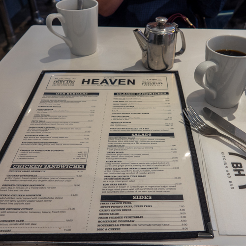
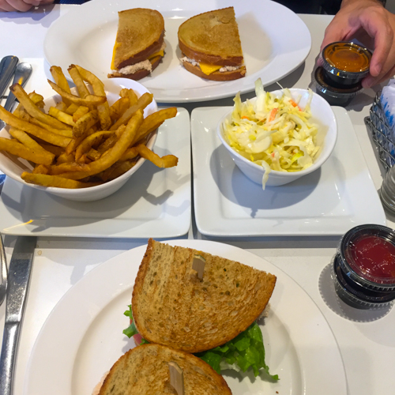
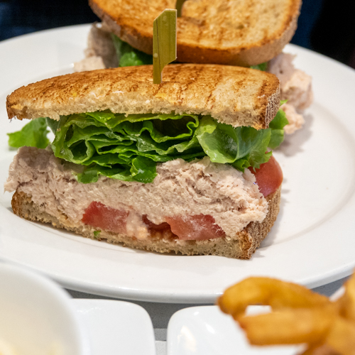
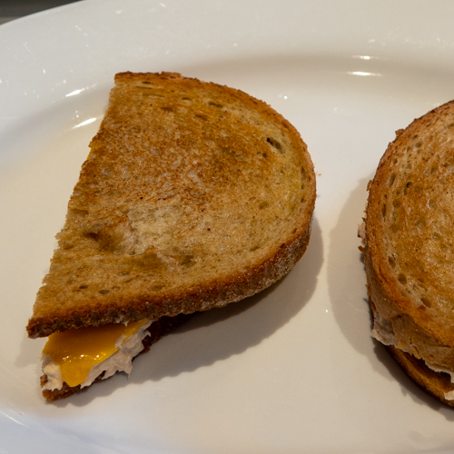
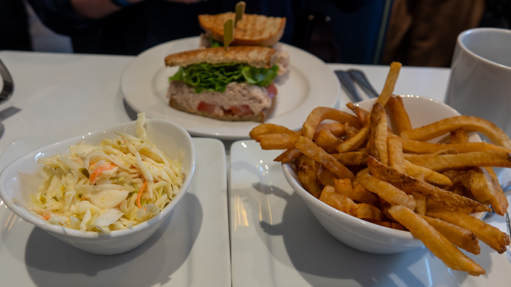

A young woman walks across the crowded diner floor, hands the manager an envelope and says, “I have a present for you.” The manager hugs her and replies, “You’re my present!” An older trio open the front doors, struggling a bit against the windy day, and a server walks over to them, gives them hugs, and they all exchange sad expressions. Variations on this theme played out many times during our visit, our final visit to Burger Heaven over the lunch hour.

The place is packed, more packed in fact than I have ever seen any of their locations. We had to wait ten minutes for a table, also a first. Everyone found out yesterday, as reported in the [Times](https://www.nytimes.com/2020/02/25/style/everybody-goes-to-burger-heaven.html) and in [Eater](https://ny.eater.com/2020/2/25/21152684/burger-heaven-closing), that this Friday would be the last day for Burger Heaven, the family-owned mini chain founded in 1943.

This was not a total surprise, since my favorite location, on East 53rd Street had already closed in December. That location, per the Times, was where Jacqueline Kennedy Onassis ate with her son, JFK Jr. (Legend has it, they also frequented [P.J. Clarke’s](http://pjclarkes.com/), another of our Midtown East favorites.) I started going to 53rd Street in the early aughts. Nora used to work across the Street at HarperCollins, but it wasn’t part of her routine. For me, it began as a reliable place for a veggie burger and fries for lunch.

Later on, Burger Heaven on 53rd became my go-to work breakfast. I flew most weeks, usually coming home late on Thursdays. Fridays, when I was back in the office at Avenue of the Americas and 54th, whenever I needed a substantial 10:30 a.m. breakfast, that’s where I would go. A few things always impressed me: the omelets were good, they were served up super fast, they buttered the toast for you (thus offering an excuse to over indulge) and the people working the counter were always so damned nice.

You get this touristy notion of gruff service people in New York, but the real story is that the city is filled with warm, friendly, funny people—if you know where to go, and especially if you become a regular. That counter was also a good place to people-watch and eavesdrop. On one of my last visits, a guy was having a work breakfast with a hedge fund manager he had just hired, “We’re gonna start you with a small position of 15 million and see what you can do with it.” Earlier that morning, we strolled past Willem Defoe walking solo along Park Avenue.

<figure>

- <figure>
    
    
    
    <figcaption>
    
    The Classic Menu
    
    </figcaption>
    
    </figure>
    
- <figure>
    
    
    
    <figcaption>
    
    The Spread
    
    </figcaption>
    
    </figure>
    

</figure>

So today, we went to our closest branch, the only one still open, at Lex and 62nd. Nora ordered her diner standard: Whiskey Radio Down (tuna on rye toast) with coleslaw, and I went for a tuna melt and fries. Did we want any dessert? Yes, a chocolate shake and an egg cream. A few minutes later, our server came back and apologized, they were all out of shakes and egg creams because of the closing.

<figure>

- <figure>
    
    
    
    <figcaption>
    
    Radio Whiskey Down
    
    </figcaption>
    
    </figure>
    
- <figure>
    
    
    
    <figcaption>
    
    Tuna Melt
    
    </figcaption>
    
    </figure>
    

</figure>

We chatted with our server over the check. “Do you know where you’re going after this?” “No,” she replied. I told her, “I used to go to 53rd Street and I never go the chance to say goodbye!” “I don’t want to cry!” she said, as she gave us a little hug. But she did, a bit, anyway.

<figure>

<figcaption>

So Long!

</figcaption>

</figure>
