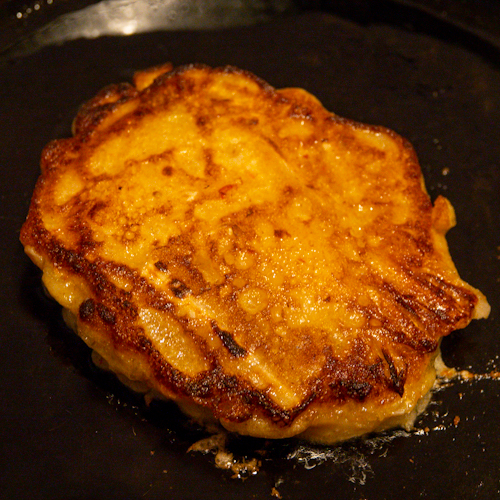

We absolutely love homemade sourdough bread, and we’ve been making it for close to four years now. For all that time, we have had two sourdough starters going. One of our starters is 50/50 whole wheat/white flour, his name is Charlie Driggs, named for the character played by Jeff Daniels in the 1986 Jonathan Demme film, Something Wild. The other starter is 100% white flour, and his name is Charlie Watts. Collectively, we call them “The Charlies.”

<figure><figcaption>Sourdough starter</figcaption></figure>

To keep the Charlies happy, we need to feed them every day. A feeding goes like this:

- Toss out 80% of the starter, leaving 20% behind
- To the remainder, add 100 g of flour
- Add 100 g of 87F water

During ordinary maintenance, the Charlies are happy with a daily feeding. But when I’m getting ready to do a bake, I will do the last couple of feedings closer together, for example, every 12 or even 8 hours. This leaves a conundrum, what to do with all the discarded starter? Just tossing it out seems like a waste.

Well, it turns out that there are a few great things you can make with the starter that you would otherwise be tossing. We have made sourdough crackers, which are amazing, and sourdough tortillas. But today, we’re doing our favorite recipe, which is also the simplest: sourdough kimchi pancakes.

The beauty of it is that sourdough starter is, on its own, already pretty close to a perfect pancake batter. I have made all sorts of sourdough pancakes, both savory and sweet, and found that a minimalist treatment works just fine. Some olive oil, an egg (or no egg for a vegan version that works out fine), a pinch of salt (unless adding other savory ingredients, like kimchi), a pinch of sugar (also optional). I’ve made them with and without baking powder, and usually leave it out.

<figure><figcaption>Nora's vegan kimchi</figcaption></figure>

Since we always have some of [Nora’s vegan kimchi](https://www.culturednyc.com/whats-fermenting-easy-homemade-vegan-kimchi/) on hand, kimchi pancakes are a weekend favorite. I can get these whipped up in under thirty minutes. I usually make the first two for Nora, then two for me, and then Nora is usually kind enough to make the last two while I eat my first two. It’s teamwork! I like mine with a side of homemade fermented hot sauce and some soy sauce. (I’d like to make it clear that these are not going to be an authentic South Korean kimchi pancake. They are delicious, but I doubt they will evoke a taste of home for South Koreans.)

<figure><figcaption>The two Charlies</figcaption></figure>
<figure><figcaption>Other ingredients</figcaption></figure>
<figure><figcaption>Building the batter</figcaption></figure>

<figure><figcaption>Adding kimchi</figcaption></figure>
<figure><figcaption>Mixing the batter</figcaption></figure>

## Ingredients

- 190 g white flour sourdough starter
- 190 g 50/50 whole wheat/white sourdough starter
- 2 tbsp olive oil
- 1 egg (optional)
- 2 tsp sugar (optional)
- 1 cup kimchi, roughly chopped

Mix ingredients in your vintage yellow Pyrex bowl. All the usual notes to making pancakes apply: don’t overmix the batter. Make sure your pan is very hot: when water droplets dance across the pan, it’s hot enough. We love our cast iron pan for this. Some olive oil in the pan will make nicely crisp pancakes. Flip when the pancakes are done around the edges, look for the tiny bubbles. This recipe will make six pancakes using 1/3 cup of batter per pancake.

<figure><figcaption>Ready to flip</figcaption></figure>
<figure><figcaption>Nice and crispy</figcaption></figure>

<figure><figcaption></figcaption>Plated!</figure>
