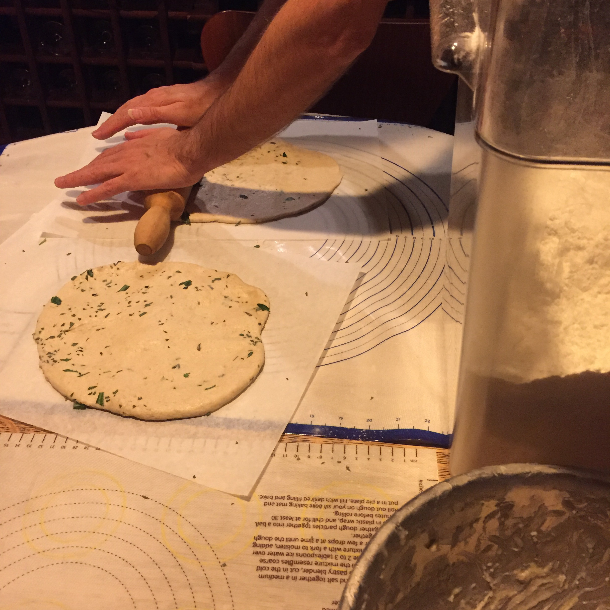

Because of COVID-19, people around the world are sheltering in place. Here in NYC, most people are hunkered down, and that includes us. We are only venturing outside for essentials, and to go for an occasional run or cautious birding trip to Central Park. Otherwise, we are at home cooking up a storm!  

We’re thrilled to see so many people take up breadmaking during this time, and sourdough bread making in particular. As we mentioned last week in our post on [easy sourdough kimchi pancakes](https://www.culturednyc.com/recipe-easy-kimchi-pancakes/), the sourdough starter process can generate a good deal of discarded starter (read, discarded flour) and now that feels more wasteful than ever.  

But there are things that you can make with starter that you would otherwise be tossing. The pancakes are one favorite of ours, and these sourdough crackers are another. The pancakes are dead simple to make, these are maybe a little trickier, but by no means as difficult as making a good quality sourdough boule.  

We started out with the [King Arthur Flour sourdough cracker recipe](https://www.kingarthurflour.com/recipes/sourdough-crackers-recipe) and have been riffing on it ever since. It’s a simple recipe at heart. Make a dough with equal parts spent sourdough starter (100% hydration, which means 50/50 flour and water) and unbleached all purpose flour, plus ¼ part butter. Season it however you like it. Roll it out thin. Top it how you like it. Cut into cracker shapes, bake it, and there you go!  

## Ingredients 

### For the dough 

- 1 cup sourdough starter (100% hydration) 
- 1 cup unbleached all-purpose flour 
- ¼ cup melted butter, cooled 
- ½ tsp salt 
- 2 tbsp grated parmesan (or dried herbs, or combination)

### For the topping 

- Kosher salt 
- Paprika 
- Grated parmesan 
- Get creative! 

## Directions 

The sourdough starter should be unfed, let’s say 24 hours or maybe a bit longer. Not what you would use to make bread, we want it to have a pronounced tang. (A 100% white flour starter, combined with white flour will make the most addictive, quasi-junkfood version of these crackers. I usually do one batch with our 100% white, and one batch with our 50/50.) Combine the dough ingredients in a bowl until it comes together. You don’t need to overwork it, you’re not making bread. Split in half. Wrap each half in cling wrap, and store in the fridge for at least 30 minutes. This step is crucial, just like you are making pasta dough. If you try to skip it, you will be very unhappy! 

<figure>

    

<figcaption>Rolling out the dough</figcaption></figure>
    
<figure>

    

<figcaption>Roll it out nice and thin</figcaption></figure>

Prepare two parchment papers to fit two ½ sheet pans. Take one of the doughs and roll it out onto the parchment paper. You have some leeway with the thickness. If you make it really thin, you will get a nice crisp cracker. The most important thing is to make the thickness consistent, or else you will have an uneven bake. 

Before you cut the dough, go over it lightly with the tines of a fork to create dimples. Add your toppings. Salt, paprika (I use smoked hot) and parmesan. Now, you can use a pizza cutter to make into cracker shapes. I usually go the long way first, then across the width. They do not need to completely separate now, they will do that during and after the bake. Once that’s done, lift the parchment paper into the sheet pan. Now you can repeat the process with the second dough and a second sheet pan. 

<figure>

    

<figcaption>Cutting the crackers</figcaption></figure>
    
<figure>

    

<figcaption>The bake</figcaption></figure>

For the bake, you can do both pans at once. 350 F for about 20 minutes. Turn and swap the pans midway through. This is the really tricky part. Depending on how evenly you rolled out the dough, the edges may get to done before the middles. Do lots of testing, often. Under baked, they won’t be satisfyingly crisp. But then they can start to get burnt in an instant. You should probably do the “Great British Baking Show crouch” for the last few minutes. 

Once they are done, take them out and cool them on a wire rack. You can break apart any crackers that haven’t separated yet. Now you can do some more “quality control,” but remember to leave some for later. They will store in an airtight container for longer than it will take for you to eat them. Our friend Kathy found this Star Wars pencil crayon tin for us at a thrift fair in Queens. That’s where we keep ours!

<figure>

  

<figcaption>Service suggestion</figcaption></figure>
