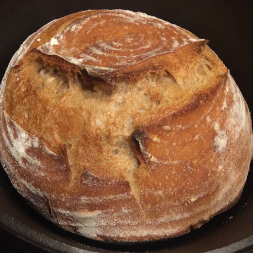
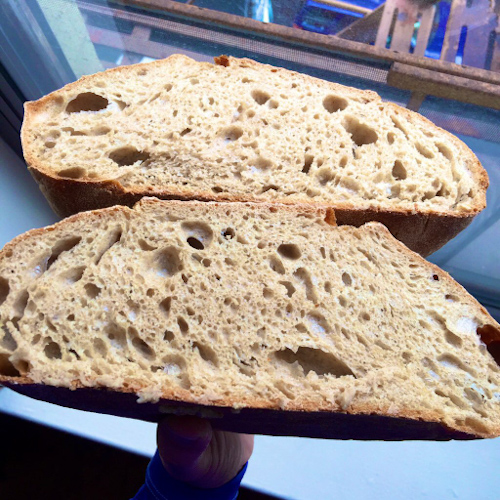

I got into bread baking about four years ago. Before venturing into sourdough, I baked many of the loaves in Ken Forkish’s great bread book, _Flour, Water, Salt, Yeast_. Once I got into sourdough I spent the next couple of years essentially making the same loaf over and over again. This was the country bread from Chad Robertson’s _Tartine Bread_. Eventually, I was practiced enough to feel comfortable riffing on the method. This recipe is for my current favorite, which is a blend of rye, whole wheat, and white flour. 

## Ingredients 

- 750 g water at 87 F 
- 200 g levain (sourdough starter) 50/50 whole wheat/unbleached all-purpose at 100% hydration 
- 200 g rye flour 
- 300 g whole wheat flour 
- 500 g unbleached all-purpose flour 
- 20 g salt 
- 50 g water at 87 F 
- Rice flour for dusting 

## Essential Tools 

- Vessel for mixing, bulk fermentation. We use a Cambro 12 qt round polypropylene food storage container. 
- Digital food scale, large format for weighing flour, dough, etc. 
- Small digital scale for weighing precise amounts of small ingredients, e.g., salt  
- Pen thermometer 
- Bench scraper 
- Lame, or razor blade, or other sharp knife for scoring 
- 2 banneton proofing baskets 
- 2 cast iron dutch ovens. We use Lodge black cast iron 4 qt. 
- Cooling rack 

## Method Overview 

1. Preparing the levain 
2. Autolyse 
3. Bulk fermentation 
4. First shaping and bench rest 
5. Shaping and proofing 
6. Scoring 
7. Baking 
8. Cooling

## The Method in Detail 

1. **Preparing the Levain** 

This is one of the most crucial elements in the entire process, since the levain is the heart and soul of this bread. Ideally, you will be feeding your levain every day, so it’s always in great shape.  For us, this is not the case. I don’t bake every week, so doing a daily feed is wasteful. If I know it will be more than a week before I bake, I will keep my levain in the fridge. You then really do need to plan ahead.  

For me, it takes several days of regular feeding to get the levain where it needs to be. My regular daily feed is to take 50 g from the previous day and add 100 g of 50/50 flour and 100 g of water. I always keep my levain at 100% hydration. For the final feeding before a bake, I up the amounts to 150 g of flour and 150 g of water. 

With practice, you will get a feel for when your levain is ready for a bake. For me, it is a combination of the activity level and the aroma. The target aroma is a little hard to describe--yeasty, sweet, a touch of funk.

2. **Autolyse** **– 30 Minutes** 

The purpose of the autolyse is to allow the water to integrate with the flour and begin to form the gluten structure of the dough. My typical autolyse time is 30-40 minutes. I have experimented with longer times, but for this recipe, 30 minutes is fine. The general guidance for an autolyse greater than 60 minutes is to leave out the levain. For a 30-minute autolyse, you can leave the levain in. 

- In your mixing vessel, begin by adding 750 g of water at 87 F 
- Add 200 g of levain 
- Stir with a flour whisk to disperse the levain into the water 
- Add the rye, whole wheat, and unbleached all-purpose flour 
- Whisk the flour, levain, and water together 
- Cover and let sit for 30 minutes 

<figure>

<figcaption>The workspace</figcaption></figure>

<figure>

<figcaption>Weigh out the water</figcaption></figure>

<figure>
    

    
<figcaption>Weigh out the levain</figcaption></figure>

<figure>

<figcaption>Mix the water and levain</figcaption></figure>

3. **Bulk Fermentation** – **3 Hours**

As the name implies, the dough will do much of its rise during this period. In this method, the dough is not kneaded in the traditional way. Instead, the dough develops structure through a series of stretches and folds. I aim for a constant dough temperature of around 80 F. If the dough gets too cold, between folds I will leave it in an oven that has been warmed to 100 F then turned off.

- Add 20 g of salt
- Add remaining 50 g of water at 87 F
- Use your hands to thoroughly mix the dough, incorporating the salt and added water
- Perform the first stretch and fold: grab a piece of dough, pull it up as far as it will stretch without breaking, then fold it back on itself, turn the vessel and continue until you have gone all the way around
- For the next three hours, perform a stretch and fold every 30 minutes, for a total of six
- At the end of three hours, the dough will has risen by around 30%, and will be very smooth and slack, and will pass the ‘window pane test’

<figure>

    
<figcaption>Second mix</figcaption></figure><figure>

<figcaption>Ready for stretch and fold</figcaption></figure><figure>

<figcaption>Stretch</figcaption></figure><figure>

<figcaption>Stretch</figcaption></figure>

4. **First Shaping and Bench Rest – 20 Minutes**

This is where things can get a little tricky, especially if you are not experienced with handling a very slack dough. All I can say is, you need to use the “Carnegie Hall” method: practice, practice, practice. We are making two boules, so the first step is to divide the dough. Then we will shape the two halves into boules and let them rest before the next step.

- Lightly flour your workspace
- Lightly flour the top and edges of the dough
- Turn the dough out onto the workspace
- Using your bench scraper, shape the dough mass into a circle, this will allow you to eyeball where to divide the dough into two equal halves
- Use your bench scraper to divide the dough
- Add some flour to the dough where you divided it
- Weigh each piece to see how close you came to equal, if necessary, add dough from one piece to another
- Shape the first boule: grab a piece of dough, stretch and fold, turn 90 degrees and repeat for a total of four folds
- Slide your bench scraper beneath the boule and flip it over
- Shape the boule by dragging it across the workspace; this will develop a smooth ‘skin’ on the top of the boule
- When the boule is shaped, let it rest and repeat with the second dough mass
- Let both boules rest for 20 minutes

<figure>

<figcaption>Turn out the dough</figcaption></figure><figure>
    

    
<figcaption>Divide</figcaption></figure><figure>

<figcaption>First shaping</figcaption></figure><figure>

<figcaption>Shaping the second boule</figcaption></figure><figure>

<figcaption>Bench rest</figcaption></figure>

5. **Shaping and Proofing – 6-12 Hours**

This is where the dough takes on its characteristic shape and finished fermenting. I use unlined banneton proofing baskets, this is where that swirly pattern comes from on the final bread. I now always do my proofing in the fridge. This allows for a longer fermentation, and I also find makes the process of scoring and transferring the bread much easier.

- For each boule, repeat the shaping process from the previous step
- Prepare the banneton baskets by dusting them liberally with flour; use rice flour to get the characteristic white swirl pattern
- Use your bench scraper to flip each boule into a banneton basket, what was the top of the boule is now on the bottom of the basket
- Cover each basket, we found specialty covers that are made for this, prior to that, we used cling wrap 
- Let the boules proof in the fridge

<figure>

    

<figcaption>Readying the bannetons</figcaption></figure>

<figure>

    

<figcaption>Flip the first boule</figcaption></figure>

<figure>

    

<figcaption>Shaggy side up</figcaption></figure>

<figure>

    

<figcaption>Flip the second boule</figcaption></figure>

<figure>

    

<figcaption>Ready for proofing</figcaption></figure>

6. **Scoring**

The purpose of scoring is to split the top of the boule to enable a strong rise in the oven. Some people take this to an artistic extreme, but I tend to be a little more utilitarian. It is worth investing in a lame. Before I had one, I tried to score the boules with a knife, and the results were disappointing.

PLEASE NOTE: for the next two steps, you are going to be dealing with an extremely hot oven, and two extremely hot dutch ovens. You need to have proper hand protection. I use silicone gloves.

- Place the two dutch ovens, lids on, near the bottom of your oven
- Pre-heat to 500 F for at least 30 minutes
- Take the first dutch oven out and remove the lid
- Quickly invert the first boule onto a lightly floured cutting board or pizza peel
- Use your lame to score the boule
- Carefully lift the boule and place it into the dutch oven (remember, it is 500 F, you will burn yourself badly if you touch it with bare hands or fingers)
- Place the lid on the dutch oven and return it to the oven
- Repeat with the second boule

<figure>

    

<figcaption>Scoring with a square pattern</figcaption></figure>

<figure>

    
<figcaption>Scoring with a stripe pattern</figcaption></figure>

7. **Baking**  

The purpose of baking in the dutch ovens with the lids on for the first part of the bake is to replicate the dose of steam that the boules would get in a commercial oven. The second part of the bake is with the lids off, to finish and caramelize the crust. Part of the fun of this method is the element of surprise when you take the lids off. That’s the moment you see how much oven spring you got, what kind of ‘ears’ you have developed and so on. 

- Bake at 500 F for 20 minutes with the lids on 
- Reduce temperature to 450 F and bake for a further 10 minutes 
- Remove the lids, and bake for a further 20 minutes, until crust is deeply caramelized 

<figure>

<figcaption>The square pattern baked</figcaption></figure>

<figure>

<figcaption>The striped pattern baked</figcaption></figure>

8. **Cooling** 

This is also an essential part of the process. Of course, you will be tempted to tear into the bread as soon as it is cool enough to handle. And you should try that at least once. Grab a big piece and just slather some butter on it. It’s amazing! But it’s not really done yet. The crust hasn’t finished hardening. And the crumb is soft and custardy. In fact, it will be a bit difficult to cut the bread into a well-formed slice at this point. Wait at least an hour. Better yet, if you are doing a night bake—which is my current preference—let it cool overnight. It will be perfect in the morning. 

- Carefully turn each boule out onto a wire cooling rack and let cool at least an hour 

<figure>

<figcaption>Square pattern cooling</figcaption></figure>

<figure>

<figcaption>Stripe pattern cooling</figcaption></figure>

## Some thoughts on this bread

If you are not familiar with this style of bread, it may cause you to rethink some of your bread assumptions. First off, the notion of ‘freshness’ and avoiding ‘day old’ bread. This bread actually keeps getting better and better. The flavor continues to develop and starts to peak after about the third day. We were at a book event with Appolonia Poilâne from the famous French bakery, and she told a story of a vacation with friends. She had brought one of Poilâne’s famous miche breads, and she and her friends ate that one bread for over 12 days, using it in ways best suited to its characteristics on each subsequent day.

There’s just two of us, and this is a substantial amount of bread. We will usually eat the first boule over about three days. At that point, we will slice up the second boule and pop it into a one gallon freezer bag and freeze it. That will usually keep us going for another few days.

<figure>

<figcaption>The crumb shot</figcaption></figure>
