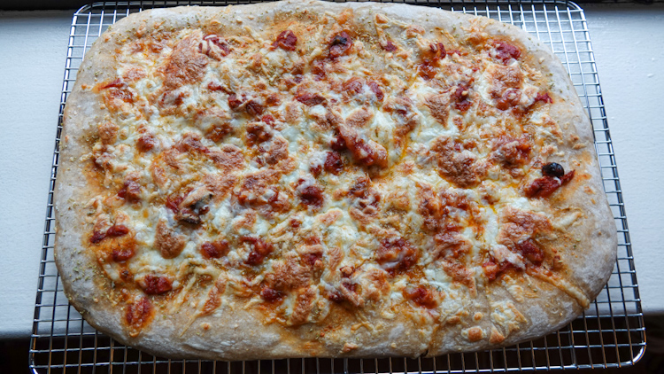

Here’s another favorite recipe–and a real crowd-pleaser–that I’ve been riffing on for the past few years. If you’re just getting into sourdough baking, this one is much more approachable than the full-on [sourdough bread recipe](https://www.culturednyc.com/recipe-rye-and-whole-wheat-sourdough-bread/) I posted earlier. In fact, this one is so straightforward that I always make the dough as a side-project while I’m making sourdough bread.  

What makes this recipe so simple? A few things. There’s no stretching and folding during bulk fermentation. The shaping is minimal, so even though the dough is very slack, there’s less risk of disaster. And since you’re baking on well-oiled parchment-paper-lined sheet pans, it’s even easier than making pizza.

#### Ingredients 

- 630 g water at 87 F 
- 20 g salt 
- 200 g levain (sourdough starter) 50/50 whole wheat/unbleached all-purpose at 100% hydration 
- 100 g rye flour 
- 100 g whole wheat flour 
- 700 g unbleached all-purpose flour 
- Olive oil 

#### Essential Tools 

- Vessel for mixing, bulk fermentation. We use a Cambro 6 qt round polypropylene food storage container. 
- Digital food scale, large format for weighing flour, dough, etc. 
- Small digital scale for weighing precise amounts of small ingredients, e.g., salt  
- Pen thermometer 
- Bench scraper 
- 2 Half sheet pans for baking, parchment paper 
- Cooling rack 

#### Method Overview 

- Preparing the levain 
- Autolyse – 30 minutes 
- Bulk fermentation – 3-4 hours 
- Shaping and proofing – 48-hour proof 
- Topping 
- Baking – 20 minutes at 475 F 
- Cooling 

#### Method 

Start with your mixing vessel and add the 630 g water. Add the salt and mix. Add the levain and mix. Add the flour and mix to combine. Leave for a 30-minute autolyse. After the autolyse, it’s time to mix the dough. You can turn it out onto a floured work surface, but I do this step inside the Cambro. Mix the dough well, using a combination of kneading, stretching, folding. This will take about five minutes. Make sure all the flour is well incorporated and there are no dry spots. Top with a brushing of olive oil, covering the entire dough mass. Cover the mixing vessel and leave it for 3-4 hours of bulk fermentation. I keep the dough at 80-81 F.  

Once bulk fermentation is done, dust a work surface with flour. Turn out the dough and divide in half. Using four ¼ turns, shape each half into a boule. Lightly flour a platter, place the boules, and cover with cling wrap. Place in the fridge for a 48-hour proof. 

To bake, cover your sheet pans with parchment paper. King Arthur Flour makes pre-cut parchment paper that I love to use. Lightly coach the parchment paper with olive oil. Turn out the dough onto each sheet pan. Some tips: let gravity do some of the work to get your dough into rectangles. The dough will be very cold and will want to snap back into its previous shape. Give it some time. Start with a rough rectangle and let it sit for 10 minutes. Then it will be easy to shape it the rest of the way. For the classic focaccia texture, dimple the dough with your fingers. 

Top each focaccia as you like. See below for some ideas. Bake at 475 F for 10 minutes, turn and swap the pans, and bake for another 10 minutes until done. Depending on your toppings, you may want a quick 3 minutes under the broiler. Check to make sure the bottom is done, if you have a pizza stone, 3 minutes directly on the stone may be helpful. 

Place on a cooling rack for 10 minutes. Unlike the sourdough bread, if you really, really want to eat this before cooling, that’s OK. I like it better after it has cooled a bit.

<figure>

- <figure>
    
    
    
    <figcaption>
    
    After the 48-hour proof
    
    </figcaption>
    
    </figure>
    
- <figure>
    
    
    
    <figcaption>
    
    Margherita, olives-anchovies-cheese
    
    </figcaption>
    
    </figure>
    
- <figure>
    
    
    
    <figcaption>
    
    Crumb!
    
    </figcaption>
    
    </figure>
    

</figure>

#### Topping Ideas 

- Dried herbs, olive oil, salt 
- Anchovies, olives, cheese 
- Cheese, cheese, cheese, & cheese 
- Pizza style 
- One of our favorites: Pissaladière-style, with caramelized onions and anchovies 

<figure>

<figcaption>

Pissaladière style

</figcaption>

</figure>

<figure>

<figcaption>

Pizza style

</figcaption>

</figure>
