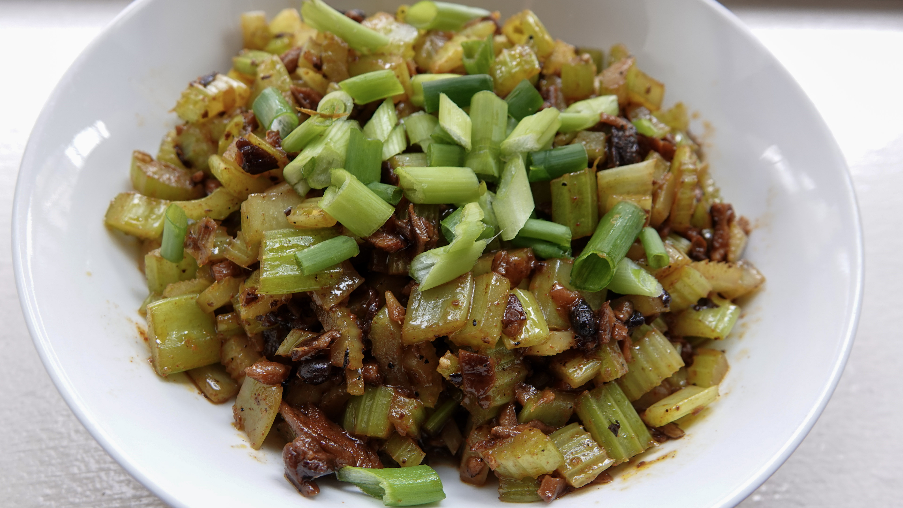

Thanks to COVID-19 era food shopping, we are finding ourselves with huge amounts of certain ingredients. Right now we have about five bunches of celery! We saw a great idea for Sichuan celery on [Ruth Reichl’s Instagram](https://www.instagram.com/ruth.reichl/). That made me think of one of our current favorite recipes, which is Diana Kuan’s [Vegetarian Mapo Tofu](http://appetiteforchina.com/recipes/vegetarian-mapo-tofu). I improvised a bit with Kuan’s recipe and came up with this recipe for the celery stir fry. It was amazing! 

## Ingredients 

- 12 dried shiitake mushrooms  
- 1 cup warm water  
- 2 tbsp fermented black beans  
- 2 tbsp olive oil  
- 3 scallions, sliced, white and green parts separated   
- 2 tsp minced ginger  
- 6 stalks celery, trimmed and chopped 

## For the sauce 

- 2 tbsp gochujang  
- 1 tbsp aji mirin  
- 2 tsp soy sauce  
- 2 tsp sesame oil  
- 1 tsp ground Sichuan pepper 

## Method 

Soak the shiitakes in the warm water for 15 minutes. Retain the soaking liquid for the sauce. Stem and mince the shiitakes (retain the stems for stock). Rinse the fermented black beans, and mash them with the back of a spoon. In a small bowl, mix together the sauce ingredients, adding a few tbsp of the shiitake soaking liquid, set aside. Heat the oil to medium high. Add in the white parts of the scallions and the ginger. Stir fry for one minute. Add in the minced mushrooms and fermented black beans. Stir fry for two minutes. Add in the celery and stir fry for a few minutes. When the celery is close to done, stir in the sauce. Set heat to high until the sauce begins to boil. Lower heat and reduce sauce. Serve in a bowl covered with the green parts of the scallions. 

<figure><figcaption>Vegan Sichuan Stir Fried Celery</figcaption></figure>
