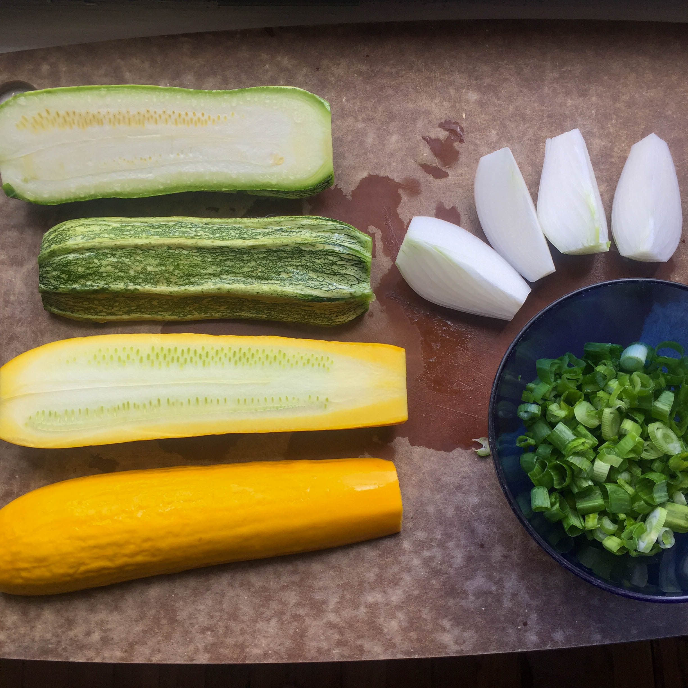
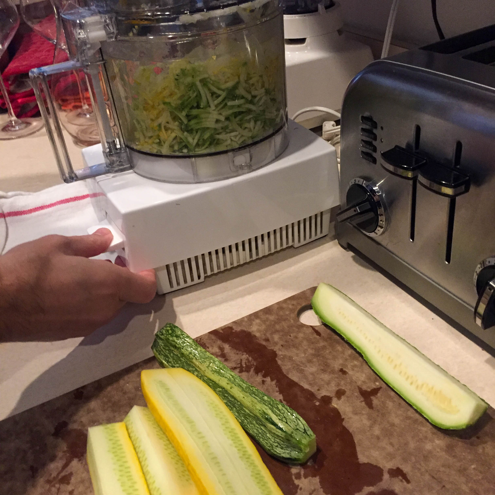
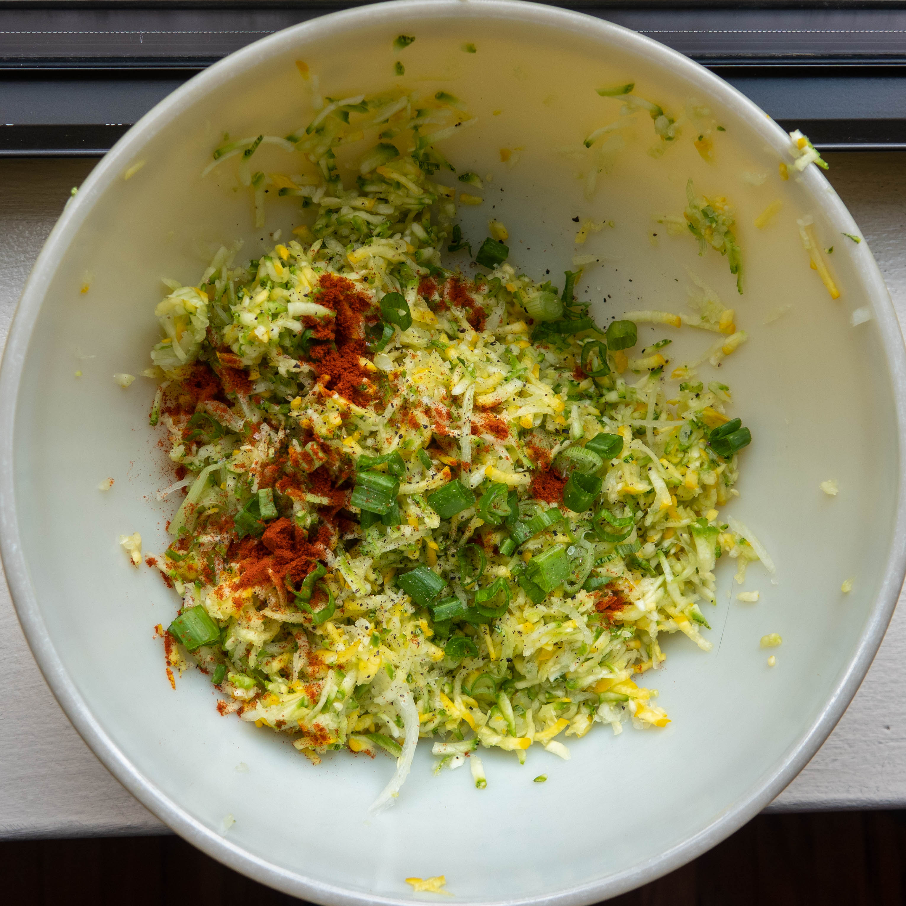

You may think of potato pancakes as latkes, but for me, growing up in a Polish household, they were “placki” (‘plah-tski), something that my Mom would whip up from scratch if we were home for lunch, or as a snack. She would grate the potatoes and onions by hand, using a box grater. They were always topped with a big dollop of sour cream. (Sour cream was part of the weekly grocery list, we were never without it.) I started making them myself some years ago, partly out of nostalgia, partly out of the realization that they can become downright exquisite with the right toppings—how about smoked sablefish, crème fraiche, and caviar, paired with a little glass of ice-cold vodka!

I don’t recall ever having zucchini pancakes growing up, but I’ve noticed that they seem to be another Polish staple. We got a couple of really nice zucchini in our farm box last week, and we have been very into savory fried pancakes lately, so we thought we would give them a try for lunch today. They turned out beautifully, and our method for making potato pancakes translated quite well. Bon appétit, or as they say in Polish, smacznego!

#### Ingredients

- 2 zucchinis
- 1 spring onion
- 1 egg
- 1 tbsp whole wheat flour
- 1 tsp salt
- 1 tsp pepper
- 1 tsp smoked paprika
- 4 tbsp olive oil
- Yogurt or sour cream to top 

- 
- 

#### Method

Prepare the zucchinis for grating, just top and tail them if using a box grater, chop into manageable pieces if using the food processor. Prep the bulb of the onion for grating. Chop the green parts of the onion and set aside for topping the pancakes. Grate the zucchinis and onions together and set into a large mixing bowl. Cover the mixing bowl with a tea towel. Invert the bowl so that its contents go into the tea towel, gathering the towel together like a giant teabag. Over the sink, squeeze as much liquid out of the grated vegetables as possible. Return the vegetables back to the mixing bowl. Add the flour, salt, pepper, paprika, egg, and mix together.

- 
- 
- 

To form the pancakes, I use a 1/3 cup measuring cup. Grab a heaping 1/3 cup of the mixture and form it into a ball with the palms of both hands. Over the sink, again squeeze out liquid as you form the balls. Let them rest on a cutting board as you portion out all of the mixture. I made seven balls out of these two large zucchini and one smallish onion.

To fry, I use either a cast iron or stainless steel pan. I do these with a generous shallow fry of olive oil. Today the pan was at about 360F. When the oil is hot, add a ball to the pan, and flatten it into a disk with a spatula. Add as many as your pan will hold without crowding. Watch for doneness on the bottom and then flip them. When done, let them rest on paper towels. To serve, top with a dollop of yogurt or sour cream, and add the chopped onion greens.

- 
- 
