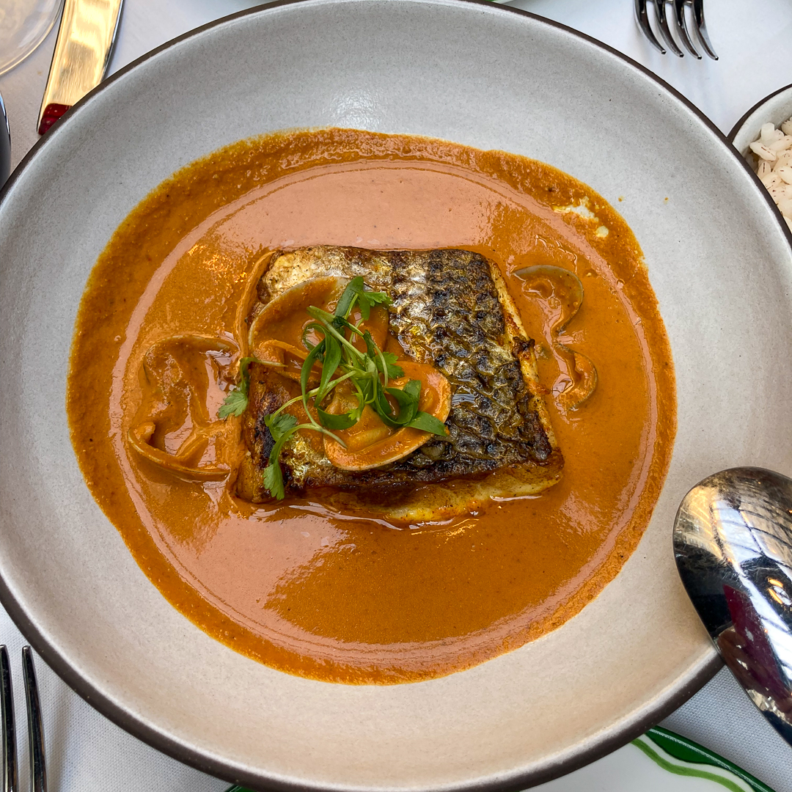

## Reemergence

We took the lockdown in NYC seriously: From March 13, 2020 to April 28, 2021 we did not dine out once, and only rarely brought in takeout. No, we made our meals at home. We're both enthusiastic home chefs, so used the opportunity raise the bar on our cooking skills.

We’d had that final pre-lockdown meal at Felidia, which, as luck would have it, was the nearest restaurant to our place—right around the corner, in fact. Over the years, Felidia evolved from a special-occasion treat to one of our top local favorites—we’d go at the drop of a hat, usually having dinner at the bar, along with a few other reliable regulars. During that time, we got to become friends with the general manager, [Santiago Pesantez](https://www.instagram.com/santo_ny/), and whenever we went, we’d have a good chat with him about restaurant news, wine, or whatever. It was a welcoming scene, and the food was marvelous!

Alas, Felidia was one of the first restaurant casualties of the lockdown—that March 13 meal was to be our last ever there. When the city began re-opening, chef [Fortunato Nicotra](https://www.instagram.com/fortunatonicotra/) (Dodo to his friends) landed at [Babbo](https://www.babbonyc.com). Santiago joined a team opening a new restaurant, a buzz-worthy, celebrity-backed, art-decco-styled contemporary Indian restaurant on East 20th in Flatiron, called [Sona](https://www.sona-nyc.com). When at last we were fully-vaccinated, on April 28th, we began to cautiously visit some of our local haunts—in their outdoor dining areas, that is. But we knew that once we were ready to venture outside the neighborhood, Sona would be our first destination. We’re glad we did, too, because we had our favorite meal of 2021.

## Location, location, location

Flatiron may well be the best restaurant neighborhood in NYC. And within the greater Flatiron, Gramercy Park, Union Square area, one could argue that there is a best block, and that would be East 20th Street, between Broadway and Park Avenue South. Let’s take a quick walk down that block, going from west to east. At no. 27, we have [Rezdôra](https://www.rezdora.nyc), an Italian restaurant that celebrates the food of Emilia Romagna, featuring house-made pastas. (If anyone has the scoop on how to get a table, please let us know, because it appears to be impossible!) At no. 28, there’s Teddy Roosevelt—no, not a restaurant but the birthplace of the former president. At no. 31, there’s [La Pizza Fresca](http://www.lapizzafresca.com), an authentic Neapolitan pizzeria, certified and all, with a very serious wine list.

No. 43 East 20th has been home to some special places: from 1999 to 2013, it was the home of Veritas, the restaurant founded by chef Scott Bryan. (If you remember Anthony Bourdain’s book _Kitchen Confidential_, after spending most of the book detailing everything that is wrong about the restaurant industry, he turned to Bryan as an exemplar of everything that is right.)

After Veritas closed, no. 43 for a time was home to [Élan](https://www.nytimes.com/2016/02/12/dining/elan-david-waltuck-flatiron-restaurant-will-close.html?smid=url-share), David Waltuck’s follow-up to his dearly departed TriBeCa classic, [Chanterelle](https://chanterellenyc.com/). Élan gave us all another chance to try Chanterelle classics, like the seafood sausage, as well as some new dishes like Sea Urchin guacamole! No. 43 is currently home to [Il Mulino](https://www.ilmulino.com/) Prime, after exiting no. 36 across the street, where for a time, it ran Il Mulino Trattoria. More on no. 36 in a moment.

Continuing eastward, at no. 42 is Danny Meyer’s [Gramercy Tavern](https://www.gramercytavern.com/), which in many ways epitomizes New York City fine dining. And anchoring the block’s eastern corner, at 250 Park Avenue South, a large space that currently houses Barbounia. Twenty years ago, when I worked at a dotcom called clickradio across the street, that space was home to [Patria](http://chefdouglasrodriguez.com/about-chef-rodriguez/), one of our favorites at the time, and where we first learned about Nuevo Latino cuisine.

So yes, there’s a lot going on on that block, and when you add in the nearby standouts—[Cosme](https://www.cosmenyc.com/), [ABC Kitchen](https://www.jean-georges.com/restaurants/united-states/new-york/abc-kitchen/), [Craft](https://www.craftrestaurant.com/), [Union Square Café](https://www.unionsquarecafe.com/) in its new digs—and countless other local charmers, that adds weight to the argument for Flatiron as the best locale. (I also think it serves as a kind of Manhattan neutral territory for downtown, midtown and uptown types.)

## Out on the town

We had run into our friend Tom Dillon earlier in the day; we hadn’t seen each other in person since you-know-when. Tom tends bar at [La Grenouille](http://la-grenouille.com/) during the lunch shift; we became friends at, and are now fellow diaspora members of [Le Veau D’Or](https://ny.eater.com/2009/1/30/6775673/who-goes-there-le-veau-d-or). He’s a long-time Gramercy resident, and when we told him where we were going for dinner, we arranged to meet inside Gramercy Park to catch up. As we wound up our chat in the park—which, with its high security, is like a lovely, lush prison yard—we made arrangements for dinner in a few weeks at [The Bluebell Café](https://thebluebellcafenyc.com/), one of those local charmers I mentioned.

Sona, at 36 East 20th is just steps away from the park. We arrived right at the opening of the dinner service. Santiago is right there at the door. Big hugs—we are glad to see each other. (Years from now, people will begin to forget just how emotional these moments of reunion were.) Chef [Hari Nayak](https://www.instagram.com/harinayak/) is right there too, and we get to say hello.

This will be about all we see of the restaurant’s interior. It [looks](https://www.vogue.com/article/first-look-inside-sona-priyanka-chopra-jonas-new-restaurant) great. [Priyanka Chopra Jonas](https://ny.eater.com/2021/3/8/22319544/priyanka-chopra-sona-nyc-restaurant-flatiron) is the celebrity backer, and muse for the restaurant. She worked with designer Melissa Bowers to create a 1930’s Mumbai Art Decco style. When things finally go back to normal, I look forward to dining in that room, and the bar looks gorgeous too. It was apparently Priyanka’s husband, Nick Jonas, who suggested the name Sona, which means gold in Hindi. (It dawned on me only later, that if you add the letter ‘J,’ it’s also an anagram for ‘Jonas.’)

We were shown to our table in the outdoor dining structure. As these go, it’s nice. We catch up with Santiago, where did everyone from Felida wind up, Flatiron as a restaurant neighborhood, everything else under the sun. Small details like the dinnerware and flatware are all on point. We order cocktails, and peruse the menus—which are on our phones, via a QR code. Our server helps us navigate. Santiago had created the wine list—which I knew, the moment I saw a few bottles of orange wine—and helped us pick a bottle. It’s a really good list, with nothing too over the top.

<figure>  

<figcaption>Elevated G&T, Old Fashioned</figcaption>
</figure>
    
<figure>

<figcaption>Crozes-Hermitage</figcaption>
</figure>

## Our meal

The cocktails are designed by mixologist Johnny Swet, and they’re quite good. Nora chose from the list of Elevated Gin Tonics. N°1 Hendricks gin, Kaffir lime, celery, coriander and Fever Tree Tonic ($19). Lovely, and as they say, very Instagramable. I went with ‘Our Old Fashioned,’ which had Old Grandad bonded Bourbon, plantation pineapple rum, cardamon bitters, twists, Luxardo cherry, ice glacier ($18). Also very good.

<figure>

<figcaption>Crab Poori and Caviar</figcaption>
</figure>

We were excited about the appetizers. We began with ‘Crab Puri and Caviar’ with butter garlic crab and Kaluga amber caviar ($24). This is rumored to be Chopra Jonas’ favorite, and it was one of ours too. Really delicious and tangy, and beautiful to behold. Next, we had the ‘Rock Shrimp Koliwada’ popcorn style fritters, mango pickle aioli ($24). Another hit. Just a little bit of heat, lovely texture, and frankly, addictive. (I can see ordering this at the bar when we make our way inside.) We also had the ‘Buckwheat Bhel’ fenugreek sprouts, raw mango, pomegranate, puffed buckwheat tossed in a citrusy chili honey dressing ($16). Also delicious and with some nice contrasting textures. We are already Hari Nayak fans at this point.

<figure>

<figcaption>Rock Shrimp Koliwada</figcaption>
</figure>

<figure>

<figcaption>Buckwheat Bhel</figcaption>
</figure>

Midway through our meal, we got to meet Sona’s restaurateur, [Maneesh K. Goyal](https://www.instagram.com/maneeshkgoyal/). He’s fairly bursting with pride at his and his team’s creation. We also have a nice chat about the restaurant’s location, and he tells us he has had this block in mind from the very beginning. I mention my history with the block and how we used to see Julia Roberts often in those days. Well, she popped in the other night. On another recent night, Danny Meyer walked in and asked if he could have dinner. He had the table next to ours, but faced west so he didn’t have to see what was transpiring down the block at Gramercy Tavern.

<figure>

<figcaption>Gruyère Cheese Dosa</figcaption>
</figure>

Our main courses arrive—we are over-ordering, because we want to try everything! Something I knew I had to try as soon as I saw it on the menu: ‘Gruyère Cheese Dosa’ edamame arbi mash, coconut and roasted tomato chutney ($22). I was wondering not so much ‘if’ it would work, as ‘how’ it would work. I think the main thing is the Gruyère is not over-applied, it adds just a bit of unexpected, but welcome, flavor and the tiniest bit of gooey texture. Man. I ordered Floyd’s Goan Fish Curry with coconut seafood broth, kokum, and red rice ($34). This dish is in honor of [Floyd Cardoz](https://www.nytimes.com/2020/03/25/dining/floyd-cardoz-dead-coronavirus.html?smid=url-share), who had been chef at nearby Tabla, and tragically died of COVID-19 in March of 2020. Nora went with Green Pepper Halibut: banana leaf wrapped fillet, fresh turmeric reduction, cassava ($38). Both were delicious and perfectly cooked. At the suggestion of our server, we had some roomali roti ($8) to help ensure we got every bit of the sauces.

<figure>

<figcaption>Floyd’s Goan Fish Curry</figcaption>
</figure>

<figure>

<figcaption>Green Pepper Halibut</figcaption>
</figure>

When it was time for desert, we also got to meet the pastry chef, a rising star and Eleven Madison Park alum, Grason Klaes. We went with ‘Coconut Kheer’ pickled strawberries, sesame lace, darjeeling tea granita ($14)--delicious, and rice pudding has always been one of Nora’s favorites—and ‘Sona Chocolate Gateaux’ cashew praline, caramelized bananas, jaggery banana kulfi ($14). A lovely way to end our meal. Around that time, David Schwimmer arrived and took up a spot at the bar. But for us, it was time to make our exit.

<figure>

<figcaption>Coconut Kheer</figcaption>
</figure>

<figure>

<figcaption>Sona Chocolate Gateaux</figcaption>
</figure>

## The bottom line

Exquisite food, fine cocktails, a terrific wine list, very pleasant service, a beautiful room, lots of buzz but not exclusive-feeling, pricey, but nowhere near gougy. We had our favorite meal of the year so far, and I expect this will be one of our top meals of 2021, if not the top. We will be back.
