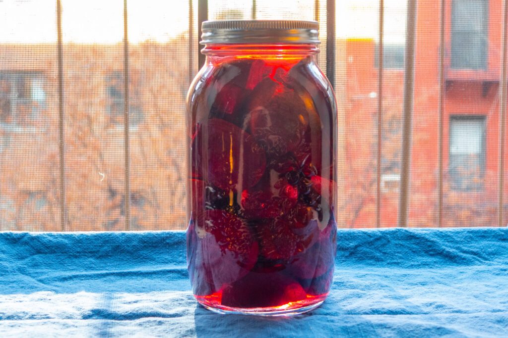

As I write this, it is one week before Christmas Eve, 2021. COVID-19 is once again booming in New York City, and we are once again in “hunker down” mode. This year, we will have a quiet Christmas at home. For a few years now, we have been doing our own personal take on a traditional Polish Christmas Eve dinner, which is known as the _Wigilia_ (from the Latin for vigil). The Wigilia is by tradition a pescetarian meal, which is perfect for us, and gives us an excuse to whip up some of our favorite Polish dishes, especially pierogi.

But the first course of a Wigilia, and in some ways, the centerpiece of the meal, is Barszcz, a clear, beautifully red, slightly sour, beet broth. The broth is served with uszki, or “little ears,” which are similar to small pierogi, but stuffed with fragrant dried Polish forest mushrooms. (The barszcz itself is typically vegan; the uszki typically have egg in the dough, but are otherwise vegetarian.) A few years ago, I got my Mom’s recipe, and it is in her customarily minimalist style:

## Barszcz 

- 1 pound beets, wash, cut in quarters
- Veggie stock
- Apple cider vinegar, normal vinegar, or squeezed lemons

(All of my Mom’s recipes are like this. In order to make sense of them, you will have had to seen them prepared, and of course, tasted them many, many times. We’re fine on both counts.)

The hint of sourness is really the key to this dish. Since we are both fermented foods enthusiasts, two years ago we hit upon the idea of using one of our own ferments in place of vinegar. The prefect candidate was beet kvass, which is quite simply the brine from fermented beets. It gives the sour kick, delivered with an intense beet flavor. The recipe and method are pure simplicity.

## Beet Kvass

- Farmer’s market beets, topped & tailed, washed, not peeled
- 3.5% salt brine

Halve or quarter the beets, and fill a large mason jar. Fill the jar with the salt brine, ensuring all beets are under the brine. Cover with an air-tight lid, or airlock. Let ferment, checking periodically for pressure build up—opening the lid once or twice a day should be fine.

<figure>

<figcaption>Beets</figcaption>
</figure>
    
<figure>
    

    
<figcaption>Topped and tailed</figcaption>    
</figure>
    
<figure>
    

    
<figcaption>Beets fermenting</figcaption>
</figure>

As with any fermented food, the key to success is to start with very fresh, high quality produce. Nora got our beets from the [Fledgling Crow Vegetables](http://www.fledgingcrow.com/) stand at the [Dag Hammarskjold Plaza Greenmarket](https://www.grownyc.org/greenmarket/manhattan/dag-hammarskjold). (They were a little surprised that Nora wanted 7.5 lbs of beets!)

With just one week to ferment, our kvass will probably be on the mild side, but we can keep it going for weeks or months more. Nora likes to drink a bit of it in seltzer water as a savory tonic.

<figure>

<figcaption>Chester's Mom</figcaption>
</figure>
