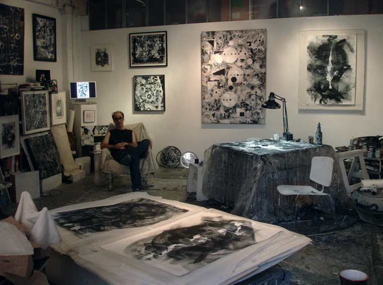

Ten years ago today, we lost our dear friend, the NYC artist Mark Wiener. Mark was one of those special humans—some of us are lucky enough to get to know one or two people like this over the course of a lifetime. Warm and kind and thoughtful and funny, he was also one of life’s great connectors—a person with a genius for bringing people together. We’d like to share a few of our thoughts and memories of Mark.

We first got to know Mark in the early years of the W. admin, initially meeting through our mutual involvement in cat rescue. Nora was volunteering with [City Critters](http://citycritters.org/), spending some time each week tending to 20 or so cats who had a midtown apartment all to themselves--a sort of cat halfway house. I think we all ended up with at least one City Critters rescue at home. The word on the street was that David Byrne had adopted one too.

Mark was a lifelong New Yorker. His parents had been Manhattan café society people. Mark loved taking us to the restaurants he had been visiting since he was “still in short pants.” La Méditeranée, P.J. Clarke’s, Gino's. (At Mark’s memorial service, one of the Gino’s bartenders said of Mark, “He was a great customer and a great friend—not such a great tipper!”). Mark would often show up at your door with a little gift, and one night, he brought us a satchel containing his parents’ collection of vintage matchbooks.

Mark had been trained in painting and photography at the Philadelphia College of Art. He’d made a career in commercial photography and worked with some of the top magazines. He'd sometimes recount stories of wild goings on, famous people he’d met and photographed. But around the time we go to know him, Mark was re-establishing himself in the fine art world. Mark and partner Linda Di Giusta founded resolve40, an online fine art magazine. The two also covered the NYC art scene for [Huffington Post](https://www.huffpost.com/entry/in-memoriam_b_1948526).

And then we got to witness the most amazing thing. In his early 50s, Mark went back to [painting](https://fineartamerica.com/profiles/mark-wiener)—not in a small way, but completely throwing himself into it and re-inventing himself. I don’t think I’ve ever seen greater dedication or work ethic. In a series of studios, which would rotate what seemed like every six months or so, Mark would work on painting all day, every day, seven days a week. The art was terrific and beautiful. We watched as he honed his technique and progressed through a series of style periods. Each was really Mark taking an idea that struck him, and then working though it with dozens of canvases. He was prolific, and constantly working. Whenever we saw him, he had paint flecks all over his clothes, his shoes, his glasses.

Mark would often show, and through him we got an introduction the NYC art scene. He was always inviting us to one of his shows, or someone else's he thought we would like. We met many artists and other great new people through Mark. It was like, if you had the Mark stamp of approval, people knew you were OK. Artists, musicians, art and music lovers, it was a scene. I had to contain my giddiness meeting Tom “Bones” Malone a few times—Tom had married one of Mark’s closest friends; Tom is also a great mensch.

And so it went for years. Mark worked at a torturous pace all day, spent every night going to galleries and shows. Always making friends, always introducing new people to each other. Mark even became long-distance friends with Nora’s father, the philosopher [Patrick Maynard](https://publish.uwo.ca/~pmaynard/). Something we really miss is that Mark would buzz our door at the end of a night, 11 or 11:30. He would arrive usually bringing something to drink, even though we always had a well-stocked bar—I don’t think Mark liked arriving empty-handed. We would all catch up and have a night cap, and then he would usually doze off on our couch for a bit.

<figure>

<figcaption>The artist Mark Wiener in his studio</figcaption>
</figure>

Mark’s final studio was at the Cold Castle, the colloquial name for a group of studios in a building with no central heating at West 21st Street and 11th Avenue. Mark did some of his best [work](https://www.saatchiart.com/mwienerarts) there, and one of our favorite pieces from that era adorns our music studio at home. Years of non-stop striving began taking a toll. Mark worked hard and was successful enough to support himself in New York City through painting abstract canvasses. That’s amazing. But in America, we are content for our artists to live on the margins and forgo things that are considered basic necessities in other countries, like healthcare. Mark could pay rent on his apartment and studio through his painting, but one thing he did not have was health insurance. When he first felt his energy waning, he thought it was from overwork, but tragically, he learned he had a serious heart condition.

When Mark eventually went into the hospital, we and all his many friends were hopeful. A few days later, on a beautiful fall day, much like today, we had just finished a run in Central Park, training hard that whole year for an upcoming marathon. We got home and heard the news, Mark had died. We were both devastated. Although we knew him for just over ten years, and now another ten years have passed, we still think about him all the time and miss him. And we’re still thankful to have had Mark as our friend.
